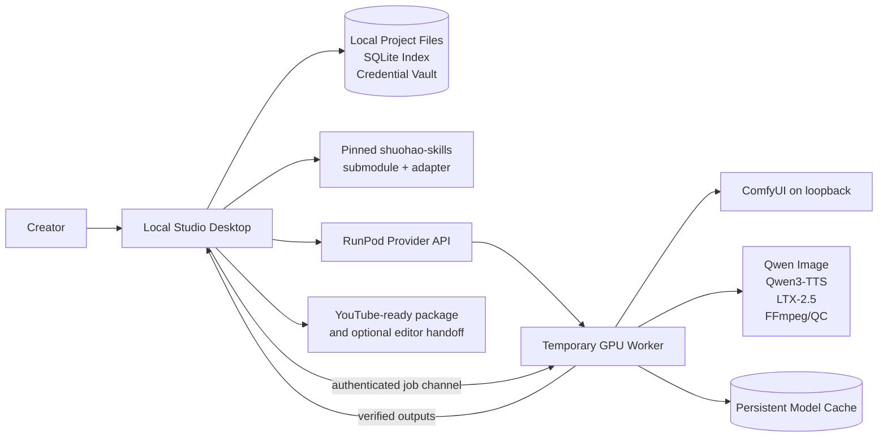
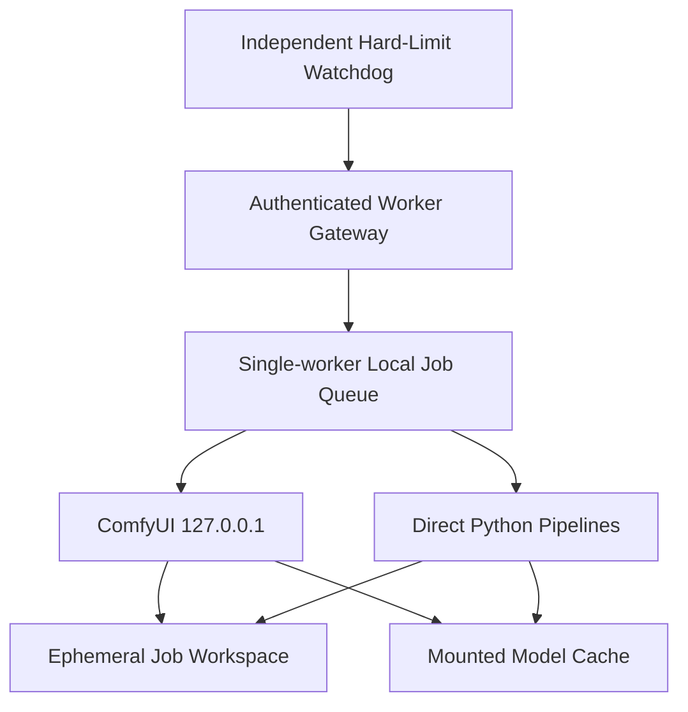
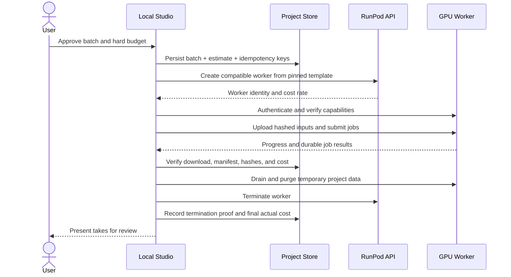

# System architecture

## 1. Architectural outcome

Animated Series Studio is a local control plane with disposable cloud execution workers.

- The **local desktop** owns projects, continuity, versions, approvals, queues, costs, and final media.
- The **pinned upstream adapter** converts useful `shuohao-skills` outputs into studio-owned domain records without modifying the upstream checkout.
- The **remote worker** executes versioned Qwen and LTX workflows on a temporary GPU.
- The **network volume** caches models and workflow dependencies; it is never the only copy of creative work.
- The **provider adapter** creates and terminates compute. RunPod is the first implementation.
- The **media-engine adapters** translate neutral jobs into Qwen, LTX, FFmpeg, and QC operations.

## 2. Context diagram



## 3. Trust and ownership boundaries

| Boundary | Authoritative data | Disposable/cached data |
| --- | --- | --- |
| Local project workspace | Story facts, bibles, scripts, shot plans, approvals, manifests, final media | Rebuildable thumbnails, waveform caches, UI indexes |
| SQLite | Transactional index, dependency and queue state | Rebuildable from manifests and project files where documented |
| Operating-system credential vault | Provider and service credentials | Short-lived worker session tokens |
| GPU worker | Active job workspace and runtime logs until synchronized | Model memory, temporary intermediates, failed partial outputs |
| Network volume | Pinned model/workflow cache | Never the only copy of project source or approved output |
| Upstream submodule | Exact upstream source at a pinned commit | Generated upstream reports are rebuildable |

The desktop must be able to recover the project even if the worker and network volume disappear.

## 4. Target repository structure

```text
animated-series-studio/
├── apps/
│   └── desktop/                  Electron main/preload + React renderer
├── packages/
│   ├── domain/                   entities, invariants, state machines
│   ├── contracts/                JSON Schemas and generated TypeScript types
│   ├── project-store/            files, SQLite index, migrations, backup
│   ├── upstream-adapter/         pinned skill invocation and normalization
│   ├── orchestrator/             durable queues, dependencies, approvals
│   ├── provider-runpod/          GPU lifecycle and cost polling
│   ├── engine-qwen-image/        neutral image job -> workflow
│   ├── engine-qwen-tts/          voice job -> Qwen3-TTS request
│   ├── engine-ltx/               neutral video job -> LTX workflow
│   ├── media/                    FFmpeg assembly, captions, probing, QC
│   └── ui-kit/                   accessible shared controls and language
├── worker/
│   ├── gateway/                  authenticated job API and watchdog
│   ├── runtime/                  Python execution modules
│   ├── docker/                   pinned, reproducible worker image
│   └── tests/                    GPU and contract smoke tests
├── workflows/
│   ├── image/                    versioned Qwen ComfyUI API workflows
│   ├── voice/                    versioned Qwen3-TTS recipes
│   ├── video/                    draft/final/A2V/keyframe/retake/lip-dub
│   └── qc/                       media validation profiles
├── config/                       locks, compatibility matrix, defaults
├── docs/                         authoritative specification
├── scripts/                      checks, updates, packaging, support bundle
└── vendor/shuohao-skills/        read-only pinned submodule
```

The existing upstream requirement that each skill remain self-contained is respected. Studio application dependencies live outside `vendor/`.

## 5. Technology baseline

| Layer | Baseline | Reason |
| --- | --- | --- |
| Desktop shell | Electron 43.4.1 | Single Windows installer, local process/file integration, credential-vault access |
| UI | React 19.2.8 + TypeScript 5.9.3 | Maintainable non-technical workflows and accessible components |
| Local services | Electron-bundled Node.js/TypeScript | Matches upstream `.mjs` tooling and desktop runtime |
| Durable index | SQLite through `node:sqlite` | Local transactions without a separately compiled native add-on; canonical files remain portable |
| Canonical contracts | Runtime Zod now; JSON Schema target | Validates current TypeScript IPC/manifests while preserving a language-neutral worker target |
| Worker gateway | Python 3.12 service | Matches LTX/Qwen ecosystems and provides a narrow authenticated API |
| Workflow engine | ComfyUI bound to loopback | Versionable graphs and current model integration without exposing its UI publicly |
| Media processing | FFmpeg/ffprobe | Deterministic assembly, normalization, probing, and export |
| Worker packaging | Docker image pinned by digest | Repeatable GPU setup with no per-session installation |
| Cloud provider | RunPod through an adapter | Temporary GPU lifecycle, templates, API control, persistent network cache |
| Secrets | Windows Credential Manager through desktop keychain adapter | No plaintext project or repository credentials |

Versions are chosen and pinned during implementation spikes. “Latest” is never a production version.

### Implemented foundation boundary

Version 0.2.0 implements `apps/desktop` plus `packages/contracts`, `packages/domain`, and `packages/project-store`. The packaged window uses context isolation, sandboxing, disabled renderer Node integration, a restrictive content policy, a narrow preload API, validated top-frame IPC callers, blocked new windows/navigation, and the `studio://app` production protocol.

The local project store currently provides:

- A rebuildable global catalog at `projects/.studio/catalog.sqlite`.
- A schema-1 `project.json` plus `project.sqlite` inside every identity-scoped project folder.
- Temporary-file write, flush, SHA-256, atomic rename, then catalog transaction.
- Startup reconciliation that indexes valid manifests and preserves invalid/unrecognized folders for later recovery.

Backup/restore, migration preview/rollback, credential vault, redacted support logging, single-writer leasing, and continuity asset versions remain Phase 1 work. No remote/cloud component is implemented or reachable from the renderer.

## 6. Local component responsibilities

### Desktop renderer

- Presents guided project, bible, episode, shot, review, cost, and export screens.
- Never receives raw provider secrets.
- Communicates only through typed Electron IPC exposed by the preload boundary.
- Keeps technical details behind an optional expert drawer.

### Desktop main process

- Owns file access, credential-vault calls, local child processes, updater, and secure IPC.
- Starts the local orchestration service and enforces a single writer per project.
- Blocks shutdown or performs a safe handoff while unsynchronized paid work exists.

### Project store

- Writes canonical JSON and media atomically using temporary file + flush + rename.
- Maintains SQLite transactions for queues, approvals, costs, and dependencies.
- Produces backup snapshots and can rebuild indexes from manifests.
- Runs versioned, reversible migrations after preview and backup.

### Workflow orchestrator

- Converts user intent into dependency-aware jobs.
- Enforces locks, stale-state checks, estimates, budgets, concurrency, retries, and terminal states.
- Uses idempotency keys so a network retry cannot create an accidental duplicate paid job.
- Persists every state transition before performing the external action.

### Continuity and impact engine

- Records `depends_on` edges between versions.
- Computes impact when a locked upstream version changes.
- Marks dependants stale without deleting approved historical outputs.
- Presents the user with `keep old`, `regenerate`, `relink`, or `defer` choices.

### Upstream adapter

- Invokes only documented upstream command-line operations.
- Captures stdout/stderr, exit code, commit, schema assumptions, and original files.
- Normalizes upstream IDs into project-scoped records while retaining source references.
- Does not treat H3 prompt strings or short-drama pacing rules as canonical LTX production data.

### Provider and engine adapters

- Provider adapter handles infrastructure only: create, inspect, estimate, terminate, and billing metadata.
- Engine adapters handle media intent only: validate capability, estimate, render, retake, and inspect result.
- Neither adapter is allowed to mutate canonical story data.

## 7. Remote worker architecture



The gateway provides health, capability, upload, job, progress, artifact, drain, and shutdown operations. It validates signed job contracts, restricts file paths to the assigned workspace, redacts secrets, and refuses unrecognized workflow versions.

ComfyUI is an internal implementation detail. It binds to `127.0.0.1`; only the gateway is reachable through an authenticated, encrypted channel.

The watchdog has the session's absolute termination deadline at boot. It must be able to call the provider termination path or shut down the machine independently of the desktop job connection.

## 8. Canonical production flow



The orchestrator does not mark a job `succeeded` until the local artifact, manifest, and hash have been verified. Provider termination is a separate recorded state.

## 9. Long-form normalization of the upstream pipeline

The upstream repository is valuable but has different production assumptions:

- It was designed for AI short drama, with examples around short episodes.
- `novel-storyboard` uses segments up to 15 seconds, enforces 2–5 second cuts, and generates MiniMax H3-specific prompts.
- Some upstream content fields are Chinese-first even when report labels can be rendered in English.
- Image calls can rely on an agent's built-in image generation rather than the studio's chosen GPU workflow.

The studio therefore uses a three-layer integration:

1. **Source layer:** immutable original upstream JSON, reports, validation results, and commit.
2. **Normalized story layer:** language-aware, long-form acts/sequences/scenes/beats, characters, locations, props, dialogue, and shot intent.
3. **Production layer:** engine-neutral shot methods and versioned LTX/Qwen job specifications.

A 20–35 minute episode is decomposed into acts, sequences, and scenes. Upstream segments and cuts can seed this structure, but the studio owns final pacing. Longer dialogue holds, reaction shots, and editorial motion are allowed without weakening or editing upstream validators.

The H3 alignment prompt remains attached as provenance only. The LTX adapter rebuilds prompts from canonical shot facts, references, audio, and timing.

## 10. Version and compatibility model

Every production manifest records:

- Studio application version.
- Project schema version and migration history.
- Upstream submodule commit and adapter version.
- Model repository, exact revision/checksum, precision, quantization, and license snapshot.
- Worker image digest, CUDA/runtime compatibility, GPU class, and driver information.
- Workflow ID/version/hash and engine adapter version.
- Canonical input and reference asset IDs, versions, and hashes.
- Prompt, negative prompt, seed, duration, resolution, frame rate, audio, and advanced parameters.
- Start/end timestamps, retries, provider IDs, measured GPU runtime, and actual/estimated cost.

A compatibility matrix in `config/` will declare tested combinations. The UI may warn about or block untested combinations; it never silently substitutes a model.

## 11. Concurrency and scale

- One local project store is the scheduler authority.
- Each remote worker processes one memory-heavy generation at a time unless its exact workflow is benchmarked for safe concurrency.
- Parallelism comes from independent workers and independent shots.
- The scheduler may use one to three workers, constrained by the user's hard budget and provider availability.
- Same-character shots do not require serial generation, but every worker receives the same locked reference pack and workflow version.
- Results can arrive out of order; editorial order is determined by shot IDs, never completion time.
- Network-volume writes use worker-specific paths to avoid corruption.

## 12. Failure containment

| Failure | Required behavior |
| --- | --- |
| Desktop closes | Remote hard-limit watchdog remains active; durable local queue recovers at restart |
| Internet fails | Worker continues only within lease; results remain temporary; hard deadline still terminates compute |
| Provider create call times out | Reconcile by idempotency tag before retrying; do not create a second worker blindly |
| Worker fails health check | Capture logs, terminate, retain local inputs, retry only within policy |
| Job crashes | Preserve error and partial diagnostics; retry from durable state or require review |
| Output transfer fails | Keep worker within bounded sync grace period; resume/check hash; never call job complete |
| Local disk fills | Stop new jobs, preserve remote result within grace period, explain recovery path |
| Upstream/model update fails | Return to previous pin and leave current productions unchanged |
| Migration fails | Restore automatic pre-migration backup and retain incident report |

## 13. Architecture acceptance gates

Before production use, tests must prove:

- No public ComfyUI exposure.
- Secrets cannot enter logs, project exports, manifests, or Git.
- Provider create retries cannot duplicate workers.
- A locally verified output exists before success and termination completion.
- Both local and remote shutdown guards work independently.
- Project restore works without a provider or network volume.
- Cross-series queries and paths cannot return another project's assets.
- A changed bible version marks the correct downstream set stale.
- The pinned upstream can be updated and rolled back without editing it.
- A production manifest can explain every approved frame and audio source.
