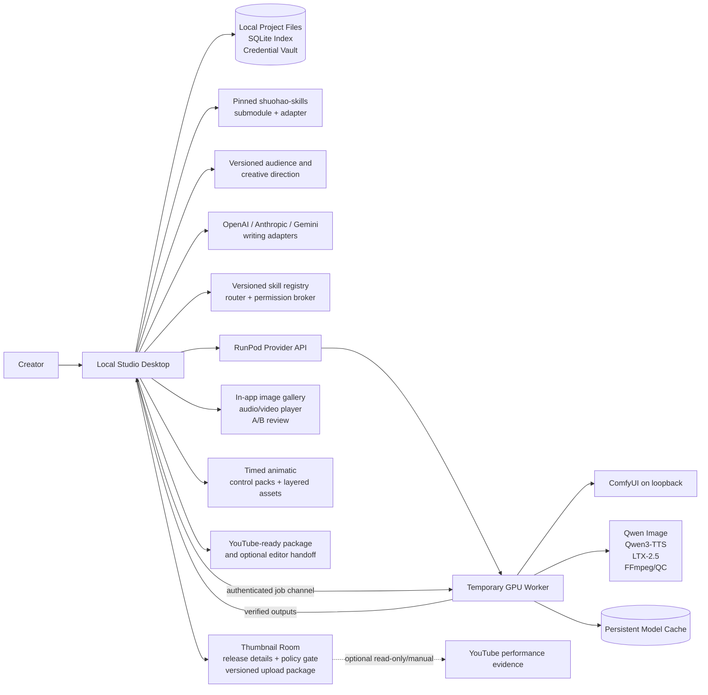
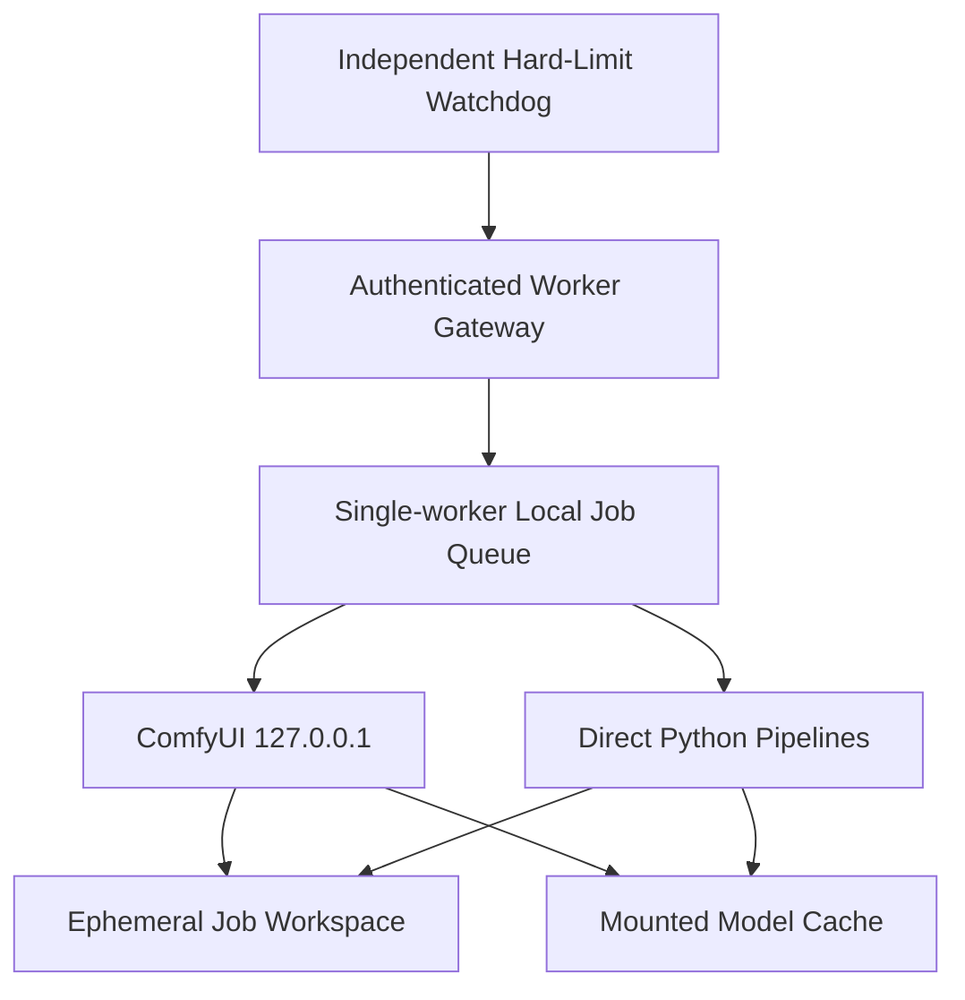
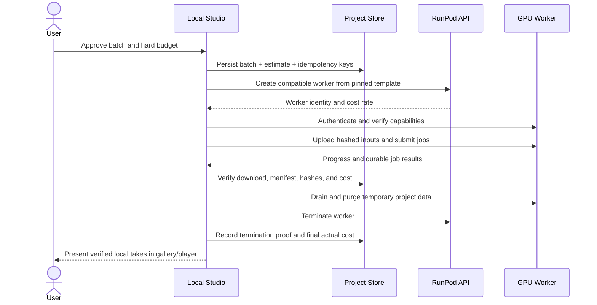

# System architecture

Current implementation note (0.10.0): the local control plane, governed field-level idea assistant, canon/media/release/performance/learning stores, restricted media viewer, RunPod provider/orchestrator, workflow registry, worker gateway/preflight/watchdog, model bootstrap, transfer client, local FFmpeg finishing, and qualification/promotion gates are implemented. Exact remote workflows and production receipts remain externally unqualified. See [PRODUCTION_IMPLEMENTATION.md](PRODUCTION_IMPLEMENTATION.md).

## 1. Architectural outcome

Animated Series Studio is a local control plane with disposable cloud execution workers.

- The **local desktop** owns projects, continuity, versions, approvals, queues, costs, and final media.
- The **pinned upstream adapter** converts useful `shuohao-skills` outputs into studio-owned domain records without modifying the upstream checkout.
- The **remote worker** executes versioned Qwen and LTX workflows on a temporary GPU.
- The **network volume** caches models and workflow dependencies; it is never the only copy of creative work.
- The **provider adapter** creates and terminates compute. RunPod is the first implementation.
- The **media-engine adapters** translate neutral jobs into Qwen, LTX, FFmpeg, and QC operations.
- The **creative-direction profile** gives each project a versioned audience, niche, tone, theme, format, boundary, style, and positioning compass without becoming canon or a platform declaration.
- The **writing-provider adapters** send a task-scoped, user-previewed context pack to the selected OpenAI, Anthropic, or Gemini API; locally validated bibles and scripts remain authoritative.
- The **skill runtime** matches enabled external skills to a task, enforces permissions and required-skill completion, validates outputs, and records exact execution receipts.
- The **studio media viewer** serves verified local images, audio, proxies, and video through the restricted application protocol. ComfyUI executes workflows but is not the creator-facing review platform.
- The **previsualization and control layer** owns timed animatics plus engine-neutral pose, depth, edge, segmentation, mask, motion-track, reference-clip, and layered-parallax assets.
- The **creative-QC layer** produces evidence-backed warnings without creating approvals, while the **audio-effects adapter** keeps ambience/foley separate from immutable dialogue masters.
- The **release layer** owns channel/profile bindings, the Idea Library, public thumbnails, release details, policy attestations, immutable upload packages, and optional evidence-only post-release learning. It has no version-1 publishing authority.

## 2. Context diagram



## 3. Trust and ownership boundaries

| Boundary | Authoritative data | Disposable/cached data |
| --- | --- | --- |
| Local project workspace | Creative-direction versions, story facts, bibles, scripts, shot plans, approvals, manifests, final media | Rebuildable thumbnails, waveform caches, UI indexes |
| SQLite | Transactional index, dependency and queue state | Rebuildable from manifests and project files where documented |
| Operating-system credential vault | Provider and service credentials | Short-lived worker session tokens |
| External writing provider | Only the explicit task context sent for the selected request | Provider-side response/conversation state is never the canonical project record |
| External skill package | Pinned manifest, instructions, schemas, permissions, source, checksum/signature status | Derived routing cache; no credential access or arbitrary project access |
| GPU worker | Active job workspace and runtime logs until synchronized | Model memory, temporary intermediates, failed partial outputs |
| Network volume | Pinned model/workflow cache | Never the only copy of project source or approved output |
| Upstream submodule | Exact upstream source at a pinned commit | Generated upstream reports are rebuildable |
| YouTube/manual analytics input | Only explicitly connected read-only metrics or user-selected reports tied to a release/profile | API response caches and derived recommendations; no platform state is canonical project data |

The desktop must be able to recover the project even if the worker and network volume disappear.

## 4. Target repository structure

```text
animated-series-studio/
├── apps/
│   └── desktop/                  Electron main/preload + React renderer
├── packages/
│   ├── domain/                   entities, invariants, state machines
│   ├── contracts/                JSON Schemas and generated TypeScript types
│   ├── project-store/            files, SQLite index, migrations, backup
│   ├── credential-vault/         OS-protected provider secret storage
│   ├── cloud-setup/              account check, local limits, setup state
│   ├── creative-writing/         protected setup, context compiler, local proposal lineage
│   ├── upstream-adapter/         pinned skill invocation and normalization
│   ├── skill-runtime/             registry, routing, permissions, receipts
│   ├── orchestrator/             durable queues, dependencies, approvals
│   ├── previsualization/         animatics, shot timing, control packs
│   ├── creative-qc/              identity, flicker, motion, speech warnings
│   ├── provider-runpod/          GPU lifecycle and cost polling
│   ├── provider-openai/          provider-neutral writing -> Responses API
│   ├── provider-anthropic/       provider-neutral writing -> Messages API
│   ├── engine-qwen-image/        neutral image job -> workflow
│   ├── engine-qwen-tts/          voice job -> Qwen3-TTS request
│   ├── engine-ltx/               neutral video job -> LTX workflow
│   ├── engine-audio-fx/          neutral ambience/effects/foley job
│   ├── adaptation/               optional project-scoped LoRA training/evaluation
│   ├── media/                    local serving/proxies, players, FFmpeg, captions, probing, QC
│   ├── release/                  profiles, ideas, thumbnails, metadata, policy gate, packages, learning
│   ├── provider-youtube-readonly/ optional least-privilege analytics adapter; no v1 publishing calls
│   └── ui-kit/                   accessible shared controls and language
├── worker/
│   ├── gateway/                  authenticated job API and watchdog
│   ├── runtime/                  Python execution modules
│   ├── docker/                   pinned, reproducible worker image
│   └── tests/                    GPU and contract smoke tests
├── workflows/
│   ├── image/                    versioned Qwen ComfyUI API workflows
│   ├── voice/                    versioned Qwen3-TTS recipes
│   ├── video/                    draft/final/A2V/keyframe/retake/lip-dub
│   └── qc/                       media validation profiles
├── config/                       locks, compatibility matrix, defaults
├── docs/                         authoritative specification
├── scripts/                      checks, updates, packaging, support bundle
└── vendor/shuohao-skills/        read-only pinned submodule
```

The existing upstream requirement that each skill remain self-contained is respected. Studio application dependencies live outside `vendor/`.

## 5. Technology baseline

| Layer | Baseline | Reason |
| --- | --- | --- |
| Desktop shell | Electron 43.4.1 | Single Windows installer, local process/file integration, credential-vault access |
| UI | React 19.2.8 + TypeScript 5.9.3 | Maintainable non-technical workflows and accessible components |
| Local services | Electron-bundled Node.js/TypeScript | Matches upstream `.mjs` tooling and desktop runtime |
| Durable index | SQLite through `node:sqlite` | Local transactions without a separately compiled native add-on; canonical files remain portable |
| Canonical contracts | Runtime Zod now; JSON Schema target | Validates current TypeScript IPC/manifests while preserving a language-neutral worker target |
| Worker gateway | Python 3.12 service | Matches LTX/Qwen ecosystems and provides a narrow authenticated API |
| Workflow engine | ComfyUI bound to loopback | Versionable graphs and current model integration without exposing its UI publicly |
| Media processing | FFmpeg/ffprobe | Deterministic assembly, normalization, probing, and export |
| Worker packaging | Docker image pinned by digest | Repeatable GPU setup with no per-session installation |
| Cloud provider | RunPod through an adapter | Temporary GPU lifecycle, templates, API control, persistent network cache |
| Writing providers | Provider-neutral contract; OpenAI Responses, Anthropic Messages, and Gemini GenerateContent adapters | Bring-your-own-key choice, structured outputs/tool use, and no canonical-data lock-in |
| External skills | Declarative, versioned studio capability packages first; compatible Agent Skill/MCP bridges only after security review | Extensibility with explicit routing, permissions, validation, execution proof, and rollback |
| Media review | Restricted `studio://` local media routes plus native image/audio/video elements and derived proxies | Review remains available after the GPU/ComfyUI worker is gone |
| Previsualization/control | Versioned animatic and engine-neutral control-asset contracts | Rich pose/motion/compositing control without exposing node graphs |
| Creative QC | Deterministic probes plus benchmarked assistive vision/speech checks | Finds likely defects while preserving human approval authority |
| YouTube release | Local versioned profiles/details/packages plus optional report import/read-only analytics adapter | Complete handoff and evidence-backed learning without automatic public mutation |
| Secrets | Electron asynchronous `safeStorage`; Windows DPAPI protects encrypted vault bytes | No plaintext project or repository credentials; fail closed when protection is unavailable |

Versions are chosen and pinned during implementation spikes. “Latest” is never a production version.

### Implemented boundary

The current source implements the secure desktop shell and local project/backup/diagnostic services plus provider-neutral writing, declarative skills, upstream import, canon/media/production/release stores, RunPod lifecycle orchestration, workflow/readiness registries, worker client/gateway, local media serving/finishing, and the renderer rooms described in [PRODUCTION_IMPLEMENTATION.md](PRODUCTION_IMPLEMENTATION.md). The desktop window uses context isolation, sandboxing, disabled renderer Node integration, a restrictive content policy, a narrow schema-validated preload API, validated top-frame IPC callers, blocked new windows/navigation, and the `studio://app`/restricted `studio://media` protocols.

The local project store currently provides:

- A rebuildable global catalog at `projects/.studio/catalog.sqlite`.
- A current schema-2 `project.json` plus `project.sqlite` inside every identity-scoped project folder, with backward-compatible schema-1 read/migration support.
- Temporary-file write, flush, SHA-256, atomic rename, then catalog transaction.
- Startup reconciliation that indexes valid manifests and preserves invalid/unrecognized folders for later recovery.
- One live writer per workspace, with token-matched release and preserved stale-lock evidence.
- SQLite checkpoint/integrity check plus flushed, SHA-256-inventoried full backups outside project folders.
- Non-overwriting restore through a verified temporary copy and atomic project-folder activation.
- Explicit v1→v2 migration preview, mandatory verified backup, stale-preview refusal, atomic manifest activation, matching SQLite history/hash update, and rollback after injected pre/post-activation/database failures.
- Immutable project-local Audience & Creative Direction sidecar versions under `bibles/creative-direction/versions`; older projects can add revision 1 without changing their manifest schema.

The RunPod key is submitted through one schema-validated IPC call, validated through the current RunPod API, encrypted by Electron `safeStorage`, and stored as encrypted bytes under application user data rather than any project. The renderer receives only connection state, aggregate Pod/rate/catalogue data and setup progress. Pod create/start/stop/delete is confined to the main-process provider/orchestrator path and remains unreachable until a qualified production pack/readiness receipt, exact estimate, maximum-cost approval, separate start confirmation, concurrency limit, and lease reconciliation all pass.

OpenAI, Anthropic, and Google Gemini use separate encrypted vault files and one non-secret atomic settings record. Settings schema 2 adds Gemini while retaining schema-1 OpenAI/Anthropic reads. Each adapter first uses its authenticated model-list read for connection validation; the setup service intersects that live list with the release-controlled catalogue before exposing any choice. A confirmed provider-neutral request is compiled from the user's instruction plus the exact previewed project-context snapshot, including the selected creative-direction version by default, then sent through OpenAI Responses, Anthropic Messages, or Gemini GenerateContent with a strict creative-draft JSON shape. The result is validated locally and written as a new proposal under the owning project's `provenance/writing` folder. Schema-3 proposals add the exact skill-plan hash, plan items, and execution receipts while schema-1/schema-2 proposals remain readable. Price remains explicitly uncalculated until benchmarked pricing profiles exist.

The first `packages/skill-runtime` slice accepts only strict declarative JSON packages. Installation copies the candidate to quarantine, limits its size, parses it without execution, computes SHA-256, refuses changed contents under the same version, stores the package outside projects, and leaves every project grant empty. Settings can enable a compatible version for an explicit project. The Creative Room matches task kinds, blocks unsupported permissions and incompatible required versions, previews a stable plan hash, refuses a stale plan, compiles the exact instructions into the provider request, validates declared minimum/required proposal sections, and writes input/output/package hashes plus provider-linked receipts. Updating a skill version revokes its project grants; removing it from active use keeps stored package evidence and historical proposal receipts. Signature verification, richer general JSON-Schema evaluation, explicit update-diff/rollback UI, and all executable/local-tool/remote-tool/MCP classes remain unimplemented and locked.

Remaining local depth includes archive UI, broader future-migration/incremental-backup support, packaged diagnostic/secret scans, explicit cross-project release-profile copy/bind, report-file analytics parsing, richer layer/control authoring, and higher-risk signed/executable/remote/MCP skill classes. Exact Qwen/LTX/LatentSync/control/foley/adaptation runtime templates, model/trainer/license decisions, GPU quality/recovery/shutdown evidence, live writing benchmarks/prices, clean-machine signing/acceptance, and long-form production remain external or release gates. Candidate definitions never count as media-engine qualification.

## 6. Local component responsibilities

### Desktop renderer

- Presents guided project setup including Audience & Creative Direction, overview revision, bible, episode, shot, review, cost, export, Thumbnail Room, Release Details, readiness, and post-release evidence screens.
- Provides one reusable idea-assistant dialog beside applicable creative/planning text fields. It displays exact context, provider/model, and skill plan; it can apply only a creator-selected suggestion and renders evidence/attestation fields explanation-only or leaves them entirely outside the assistant.
- Owns reusable presentation-only form guidance: visible required markers, live length/range state, invalid styling, and accessible correction summaries. It keeps actions available until work is actually running, but it never replaces main-process/domain schema validation.
- Never receives raw provider secrets.
- Communicates only through typed Electron IPC exposed by the preload boundary.
- Keeps technical details behind an optional expert drawer.

### Desktop main process

- Owns file access, credential-vault calls, local child processes, updater, and secure IPC.
- Starts the local orchestration service and enforces a single writer per project.
- Blocks shutdown or performs a safe handoff while unsynchronized paid work exists.
- Owns the structured diagnostic sink and local-only support-file creation; the renderer can submit only one bounded crash record and never receives a generic logging or filesystem method.

### Project store

- Writes canonical JSON and media atomically using temporary file + flush + rename.
- Maintains SQLite transactions for queues, approvals, costs, and dependencies.
- Produces backup snapshots and can rebuild indexes from manifests.
- Runs versioned, reversible migrations after preview and backup.
- Appends immutable creative-direction sidecar versions and reads the latest valid project-owned revision without overwriting earlier files.

### Workflow orchestrator

- Converts user intent into dependency-aware jobs.
- Enforces locks, stale-state checks, estimates, budgets, concurrency, retries, and terminal states.
- Uses idempotency keys so a network retry cannot create an accidental duplicate paid job.
- Persists every state transition before performing the external action.

### Continuity and impact engine

- Records `depends_on` edges between versions.
- Resolves character identity separately from scoped presentation/style/wardrobe/story-state bindings at shot, scene, episode, season, and future-default boundaries.
- Computes impact when a locked upstream version changes.
- Marks dependants stale without deleting approved historical outputs.
- Presents the user with `keep old`, `regenerate`, `relink`, or `defer` choices.

### Upstream adapter

- Invokes only documented upstream command-line operations.
- Receives the exact selected Audience & Creative Direction version as a normalized input for outline, cast, art, script, storyboard, and shot-recipe work rather than editing the pinned skill source.
- Captures stdout/stderr, exit code, commit, schema assumptions, and original files.
- Normalizes upstream IDs into project-scoped records while retaining source references.
- Does not treat H3 prompt strings or short-drama pacing rules as canonical LTX production data.

### Provider and engine adapters

- Provider adapter handles infrastructure only: create, inspect, estimate, terminate, and billing metadata.
- Engine adapters handle media intent only: validate capability, estimate, render, retake, and inspect result.
- Neither adapter is allowed to mutate canonical story data.

### Writing-provider adapters

- Accept a neutral task such as character/story drafting or creative-direction, visual, voice, motion, control, edit/sound, foley, adaptation, thumbnail, release, and evidence-analysis planning plus explicitly selected local context versions.
- Compile the task to the selected provider API without storing provider conversation state as the project source of truth.
- Return schema-validated draft proposals, usage, cost metadata, model identity, and safe errors; only a reviewed studio operation can create a canonical version.
- Obtain provider credentials in the main process immediately before the call. The renderer and skill runtime receive only opaque provider status.

### Creative-direction compiler

- Selects one exact project-owned profile version and records its ID, revision, timestamp, and hash on every consuming job.
- Combines direction with only the approved canon, identity/style binding, script, timing, control, and release facts required by that stage; it never sends a giant global prompt to every engine.
- Translates neutral audience/tone/format/style guidance into task-specific writing, upstream, image, voice, video, thumbnail, and release briefs while keeping engine prompts disposable and reproducible.
- Treats comparable works as non-copying direction and has no authority to complete child-directed, synthetic-media, truthfulness, originality, rights, or full-watch attestations.
- Uses the dependency engine to preview affected future/unapproved work after a revision; historical approved outputs retain their original profile pin.

### External-skill runtime

1. Validate and pin the installed manifest, source, version, checksum/signature status, compatibility, and requested permissions.
2. Match the current task to enabled project-scoped skills and show the proposed required/optional skill plan.
3. Compile instructions and declared tools into the provider request; never inject every installed skill indiscriminately.
4. Enforce required-skill calls or validated prompt-skill output before the job can succeed.
5. Validate each skill result, apply timeout/output limits, and persist an execution receipt containing the exact skill version, inputs by hash, calls, result hash, and status.
6. Display `Skills used` on the draft and manifest. A missing required receipt is a failed job, not a successful unskilled fallback.

Declarative instruction/schema skills cannot execute arbitrary code. Executable extensions, ComfyUI custom nodes, local MCP servers, and remote MCP tools are separate permission classes with installation preview, allowlists, isolation, and compatibility/security tests. Skills never receive raw provider credentials.

Version 0.8.0 implements the declarative portion above with two deliberately narrow schema contracts: `studio-writing-context-v1` declares which user-selected local context is required, and `studio-creative-draft-v1` declares a minimum section count plus required section headings. A successful receipt proves that the exact versioned instruction was compiled into the provider request and that the returned proposal passed those declared structural checks; it does not claim that a model achieved creative quality. Human review remains required. Tool calls, arbitrary JSON Schema, network access, local execution, and MCP remain blocked rather than simulated.

### Local media review and serving

- The artifact service downloads every completed output, verifies size/type/hash, writes it atomically to the project, and indexes the canonical original before review.
- A restricted `studio://media/...` handler serves only project-authorized files; direct arbitrary `file://` access is not exposed to the renderer.
- The media package creates rebuildable thumbnails, waveforms, poster frames, and lightweight review proxies. Originals are immutable inputs to those derivatives.
- The renderer provides image zoom/pan, side-by-side comparison, audio playback/waveform/captions, and video playback, scrubbing, frame/time navigation, synchronized A/B review, approval, rejection, and targeted retake.
- During generation, bounded preview frames and progress events may be relayed from the worker. A preview is never accepted as the final artifact.

### YouTube release and learning

- The current immutable release-profile revision is local to one project and separate from the series style/story bible. Ideas, metadata, thumbnails, performance snapshots, and learnings remain project scoped; a future shared-channel profile requires an explicit copy/bind contract rather than hidden reuse.
- The Thumbnail Room uses approved project assets and the image adapter for visual work, then applies exact text/layout locally. Candidate comparison is not represented as an audience experiment without imported platform evidence.
- The release-details service validates title/description/tags/language/category fields and creates chapters from the locked final timeline. It supplies deterministic warnings, not a universal ranking score.
- The policy/rights gate requires human audience, applicable synthetic-media, truthfulness, originality, rights/credits, and full-watch attestations. Models and defaults have no attestation authority.
- The packager writes a new hash-inventoried release directory containing master, captions, selected thumbnail, details, chapters, credits, attestations, QC, checklist, and manifests; a locked version is immutable.
- Version 0.10 accepts structured manual official/report/rehearsal evidence without an account connection. Snapshots pin source, time window, collection time, metric-definition version, missing-data warnings, and baseline eligibility. Learning proposals cite snapshots and remain separate until human approval/rejection. Report-file parsing and an optional least-privilege read-only adapter remain future boundaries.
- No version-1 service has a video/thumbnail/caption insert, update, schedule, delete, playlist-mutation, or public-publish operation.

### Previsualization and control assets

- The animatic service assembles storyboard versions, approved or explicitly temporary audio, captions, shot durations, and simple editorial motion into a versioned preview timeline before bulk video generation.
- A control pack references immutable control assets such as start/end frames, pose/depth/edge/segmentation maps, masks, motion tracks, and rights-cleared reference clips. Canonical records never contain ComfyUI node IDs.
- The layer service derives or imports foreground/subject/background plates, masks, occlusion order, and camera-safe margins while retaining the original image unchanged.
- Engine adapters declare supported control roles. Unsupported combinations fail before estimate/authorization rather than being ignored.

Version 0.10 implements the storage/UI foundation as explicit media roles and creates an ordered ID/kind/label/hash manifest from selected approved controls. It registers Qwen-image and LTX control workflows only as non-billable candidates. Typed coordinate/time-basis metadata, layer authoring, and exact adapter/template qualification remain open.

### Creative QC and audio effects

- Creative-QC adapters may compare approved references, expected continuity facts, script text, audio, and output frames to produce timestamped evidence and confidence-labelled warnings.
- Automated checks cannot alter review state, approve a take, waive a right, or modify media.
- Audio-effects adapters generate or import ambience, effects, and foley as independent media versions. Dialogue, music, room tone, and generated effects remain separate timeline layers.
- Speech recognition is a verifier against the approved line, not the source of captions or canonical dialogue.

The current foley slice provides planning assistance, a separate `foley` job/output class, dialogue-preservation input, effect media lineage, and a non-billable workflow definition. It does not select or license an audio model, claim synchronization quality, or run paid work.

### Optional adaptation

- Adaptation jobs use only an explicitly approved, rights-reviewed project dataset and an exact base-model revision.
- The trained LoRA or equivalent artifact is project-scoped, hashed, benchmarked against the reference-only baseline, and rejected if it regresses identity, style range, composition, safety, runtime, or cost beyond the accepted threshold.
- A production workflow never starts training implicitly because a generation failed.

The current candidate input requires exactly one approved adaptation-dataset manifest plus explicit reference-only-benchmark-failed and dataset-rights confirmations before estimate. The candidate still has no qualified trainer/template and therefore cannot start paid work or promote an artifact.

## 7. Remote worker architecture



The gateway provides health, capability, upload, job, progress, artifact, drain, and shutdown operations. It validates signed job contracts, restricts file paths to the assigned workspace, redacts secrets, and refuses unrecognized workflow versions. Production jobs cannot invoke ComfyUI Manager, package installers, Git, arbitrary downloads, or runtime dependency changes.

ComfyUI is an internal implementation detail. It runs headlessly, binds to `127.0.0.1`, accepts compiled workflows from the gateway, and emits progress/preview/output events; only the gateway is reachable through an authenticated, encrypted channel. The normal user never needs its browser graph. Any future expert diagnostic access must be time-limited, authenticated, off by default, and unable to bypass workflow/version recording.

The watchdog has the session's absolute termination deadline at boot. It must be able to call the provider termination path or shut down the machine independently of the desktop job connection.

## 8. Canonical production flow



The orchestrator does not mark a job `succeeded` until the local artifact, manifest, and hash have been verified. Provider termination is a separate recorded state.

After picture/sound lock, the release layer works entirely from verified local media: build thumbnail candidates and release details, resolve policy/rights attestations, lock a new release-package version, and hand it to the creator for manual upload. Post-release evidence returns only through an explicit report import or optional read-only connector and cannot mutate the locked production flow.

## 9. Long-form normalization of the upstream pipeline

The upstream repository is valuable but has different production assumptions:

- It was designed for AI short drama, with examples around short episodes.
- `novel-storyboard` uses segments up to 15 seconds, enforces 2–5 second cuts, and generates MiniMax H3-specific prompts.
- Some upstream content fields are Chinese-first even when report labels can be rendered in English.
- Image calls can rely on an agent's built-in image generation rather than the studio's chosen GPU workflow.

The studio therefore uses a direction input plus three integration layers:

1. **Direction input:** exact project audience, niche, tone, themes, boundaries, format, visual direction, and differentiation version.
2. **Source layer:** immutable original upstream JSON, reports, validation results, and commit.
3. **Normalized story layer:** language-aware, long-form acts/sequences/scenes/beats, characters, locations, props, dialogue, and shot intent.
4. **Production layer:** engine-neutral shot methods and versioned LTX/Qwen job specifications.

A 20–35 minute episode is decomposed into acts, sequences, and scenes. Upstream segments and cuts can seed this structure, but the studio owns final pacing. Longer dialogue holds, reaction shots, and editorial motion are allowed without weakening or editing upstream validators.

The H3 alignment prompt remains attached as provenance only. The LTX adapter rebuilds prompts from canonical shot facts, references, audio, and timing.

## 10. Version and compatibility model

Every production manifest records:

- Studio application version.
- Project schema version and migration history.
- Upstream submodule commit and adapter version.
- Model repository, exact revision/checksum, precision, quantization, and license snapshot.
- Worker image digest, CUDA/runtime compatibility, GPU class, and driver information.
- Workflow ID/version/hash and engine adapter version.
- Canonical input and reference asset IDs, versions, and hashes.
- Audience & Creative Direction profile ID, revision, timestamp, and hash used to compile the task.
- Resolved character identity and presentation/style binding IDs plus the scope boundary that selected them.
- Prompt, negative prompt, seed, duration, resolution, frame rate, audio, and advanced parameters.
- Writing provider/model/profile, token usage/cost, selected canonical context versions, and external-skill execution receipts where applicable.
- Original media hash plus derived thumbnail/proxy recipes and hashes; derived files never replace the original identity.
- Animatic version, resolved control-pack assets/hashes, layered-composite recipe, prompt-enhancer input/output, advanced LTX adapter/profile, adaptation artifact, and creative-QC evidence where applicable.
- Release profile/brief, thumbnail candidate/source/layout hashes, selected release-details version, ruleset/attestation versions, package inventory, linked platform ID, performance snapshot, and approved-learning IDs where applicable.
- Start/end timestamps, retries, provider IDs, measured GPU runtime, and actual/estimated cost.

A compatibility matrix in `config/` will declare tested combinations. The UI may warn about or block untested combinations; it never silently substitutes a model.

## 11. Concurrency and scale

- One local project store is the scheduler authority.
- Each remote worker processes one memory-heavy generation at a time unless its exact workflow is benchmarked for safe concurrency.
- Parallelism comes from independent workers and independent shots.
- The scheduler may use one to three workers, constrained by the user's hard budget and provider availability.
- Same-character shots do not require serial generation, but every worker receives the same locked reference pack and workflow version.
- Results can arrive out of order; editorial order is determined by shot IDs, never completion time.
- Network-volume writes use worker-specific paths to avoid corruption.

## 12. Failure containment

| Failure | Required behavior |
| --- | --- |
| Desktop closes | Remote hard-limit watchdog remains active; durable local queue recovers at restart |
| Internet fails | Worker continues only within lease; results remain temporary; hard deadline still terminates compute |
| Provider create call times out | Reconcile by idempotency tag before retrying; do not create a second worker blindly |
| Worker fails health check | Capture logs, terminate, retain local inputs, retry only within policy |
| Job crashes | Preserve error and partial diagnostics; retry from durable state or require review |
| Output transfer fails | Keep worker within bounded sync grace period; resume/check hash; never call job complete |
| Local disk fills | Stop new jobs, preserve remote result within grace period, explain recovery path |
| Upstream/model update fails | Return to previous pin and leave current productions unchanged |
| Migration fails | Restore automatic pre-migration backup and retain incident report |
| Writing provider fails or changes response shape | Preserve the local task/context, record safe error/usage where available, and retry or switch provider only with a new draft lineage |
| Creative-direction version is missing, damaged, or belongs to another project | Refuse that version, preserve older valid versions, and require a project-owned selection or repair before affected generation |
| Required skill fails or is ignored | Fail the creative job, preserve diagnostics without secrets, and require retry, compatible skill version, or explicit plan change |
| Preview/proxy generation fails | Keep the verified original unchanged and rebuild only the derived review media locally |
| Control asset unsupported or mismatched | Block before estimate/authorization and identify the incompatible control/profile |
| Creative-QC service fails | Preserve the original take; mark assistive checks unavailable and require normal human review |
| Adaptation benchmark regresses | Reject candidate and retain the reference-only workflow plus prior production pin |
| Runtime requests a missing node/model | Quarantine and terminate; rebuild/test a new worker release outside production |

## 13. Architecture acceptance gates

Before production use, tests must prove:

- No public ComfyUI exposure.
- Secrets cannot enter logs, project exports, manifests, or Git.
- Required external skills cannot be silently skipped and every claimed use has a valid exact-version receipt.
- Images/audio/video remain reviewable in the studio after the remote worker and ComfyUI session terminate.
- Provider create retries cannot duplicate workers.
- A locally verified output exists before success and termination completion.
- Both local and remote shutdown guards work independently.
- Project restore works without a provider or network volume.
- Cross-series queries and paths cannot return another project's assets.
- A changed bible version marks the correct downstream set stale.
- The pinned upstream can be updated and rolled back without editing it.
- A production manifest can explain every approved frame and audio source.
- A timed animatic can be rebuilt from its pinned inputs and changing timing marks only the correct downstream work stale.
- Advanced control, layered-parallax, creative-QC, foley, and optional adaptation fixtures pass without runtime dependency installation or automated creative approval.
