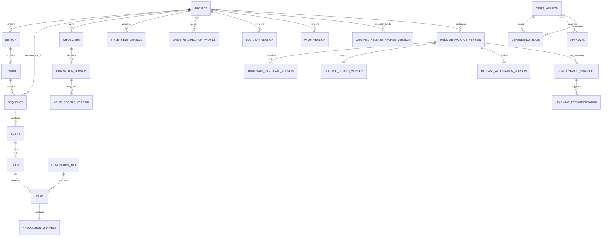

# Domain model and file layout

## 1. Design rules

- Internal identity uses immutable ULIDs; human-readable codes are scoped labels and may be changed safely.
- Every mutable creative object has immutable versions.
- Approval applies to a version, never to an unversioned name.
- Deleting from the UI means archive by default. Physical deletion is a separate, scoped maintenance action.
- Derived media records exact input-version dependencies and hashes.
- Remote file paths are never stored as the only location of an asset.
- Project JSON and manifests are portable; SQLite accelerates and coordinates them.

## 2. Aggregate hierarchy



## 3. Core records

### Project

| Field | Meaning |
| --- | --- |
| `id` | Immutable ULID |
| `code` | Human-readable short code |
| `type` | `series` or `film` |
| `title` | Display title |
| `status` | `development`, `production`, `paused`, `completed`, `archived` |
| `language` | Primary story/dialogue language |
| `deliveryProfileId` | Pinned resolution/frame-rate/audio/export profile |
| `budgetPolicyId` | Default estimates, hard caps, and worker limit |
| `schemaVersion` | Current canonical project-manifest version; version 2 is written by new projects |
| `lifecycle.archivedAt` | Archive timestamp or `null` |
| `lifecycle.statusBeforeArchive` | Reversible pre-archive state or `null` |
| `createdAt`, `updatedAt` | Audit timestamps |

Series projects use seasons and episodes. Film projects can use a single implicit production plus sequences; both converge on scenes and shots.

### Audience and creative-direction profile

`CreativeDirectionProfile` is an immutable project-owned sidecar, not an approved story fact or a release attestation.

| Field | Meaning |
| --- | --- |
| `schemaVersion` | Profile contract version; current value `1` |
| `profileId` | Immutable ULID for this revision |
| `projectId` | Owning project; cross-project use is invalid |
| `revision` | Monotonic project-local revision beginning at `1` |
| `createdAt` | Immutable creation timestamp |
| `direction.targetAudience` | Plain-language intended viewers and interests |
| `direction.ageBand` | Creative maturity guidance: `all-ages`, `children`, `teens`, `young-adults`, `adults`, `mixed`, or `undecided`; never a made-for-kids answer |
| `direction.primaryNiche`, `genres` | Subject/experience space and story conventions |
| `direction.toneKeywords`, `coreThemes`, `storyPromise` | Feeling, recurring ideas, and reliable viewer experience |
| `direction.culturalSetting`, `contentBoundaries` | Story context and matters to avoid/handle carefully |
| `direction.episodeFormat` | Expected film/episode length, structure, and serialization pattern |
| `direction.youtubePositioning`, `visualStyleNotes` | Truthful public framing and high-level art language |
| `direction.comparableTitles`, `differentiation` | Directional neighbourhood plus explicit originality; no copying authority |

Each new revision writes `bibles/creative-direction/versions/creative-direction-v####-<profileId>.json`. Earlier revisions remain readable. Existing projects may have no profile until the creator adds revision 1; this is not a manifest-schema error. Consuming records pin profile ID, revision, timestamp, and hash.

### Creative definition records

The following use a stable identity record plus immutable versions:

- Character and character version.
- Voice profile and voice profile version.
- Style bible and style bible version.
- Location and location version.
- Prop and prop version.
- Wardrobe and wardrobe version.
- Script and script version.
- Storyboard and storyboard version.
- Animatic and animatic version.
- Control pack and control-asset version.
- Layered composite and layered-composite version.
- Creative-QC report version.
- Audio-effects cue and audio-effects cue version.
- Adaptation profile and adaptation-profile version.
- Delivery profile and workflow profile.

Each version contains:

```json
{
  "id": "01J...",
  "entityId": "01J...",
  "version": 3,
  "status": "draft",
  "basedOnVersionId": "01J...",
  "contentPath": "bibles/characters/CHAR-A/v003/character.json",
  "contentSha256": "...",
  "createdAt": "2026-08-21T10:00:00Z",
  "createdBy": "local-owner",
  "changeReason": "Approved winter wardrobe and clearer side profile"
}
```

Version status is `draft`, `in_review`, `approved`, `locked`, `superseded`, or `archived`. Locking does not erase prior versions.

### Shot

| Field | Meaning |
| --- | --- |
| `id` | Immutable shot identity |
| `code` | Example `E003-SC012-SH004` |
| `sceneId` | Owning scene |
| `editorialOrder` | Stable planned order |
| `durationFrames` | Canonical duration in frames, not a floating-point guess |
| `productionMethod` | `hold`, `pan_zoom`, `layered_parallax`, `loop`, `ltx_i2v`, `ltx_a2v`, `ltx_keyframe`, `ltx_control`, `ltx_v2v`, `ltx_multishot`, `ltx_dfr`, `ltx_retake`, `ltx_lipdub`, `external` |
| `storyIntent` | Narrative purpose and required action |
| `cameraIntent` | Framing and movement, engine-neutral |
| `dialogueLineIds` | Approved line versions used by the shot |
| `referenceBindings` | Pinned character identity + scoped presentation/style, location, prop, and wardrobe versions |
| `controlPackVersionId` | Optional pinned engine-neutral control assets and compatibility requirements |
| `animaticBinding` | Animatic version and exact shot-timing revision approved for production |
| `acceptanceNotes` | What must be true for approval |
| `state` | Planning/review/production state |

Durations use `frames` plus a delivery profile frame rate. Generated-model durations are derived and reconciled explicitly.

### Take

A take is an immutable candidate output for a shot.

```json
{
  "id": "01J...",
  "shotId": "01J...",
  "takeNumber": 4,
  "sourceJobId": "01J...",
  "manifestId": "01J...",
  "mediaAssetVersionId": "01J...",
  "reviewState": "pending",
  "qualityFlags": [],
  "createdAt": "2026-08-21T10:00:00Z"
}
```

Review state is `pending`, `approved`, `rejected`, `needs_retake`, or `superseded`. A shot may have one active approved take per timeline version; earlier approvals remain in history.

### Voice profile version

Stores:

- Voice origin: `designed`, `built_in`, or `consented_reference`.
- Rights/consent record and permitted use.
- Qwen model/revision and conditioning type.
- Reference audio/transcript hashes or reusable prompt artifact.
- Language, accent, age range, timbre, pace, pitch, performance rules.
- Pronunciation dictionary version.
- Approved calibration lines and acceptance notes.

Celebrity/public-figure imitation is not a supported default. Reference voices need documented permission.

### Generation job

| Field | Meaning |
| --- | --- |
| `id` | Studio job ULID |
| `idempotencyKey` | Stable key for external retries |
| `projectId` | Isolation scope |
| `jobType` | Image, TTS, video, retake, lip-dub, upscale, layer extraction, animatic, audio effects, adaptation, assembly, technical QC, creative QC |
| `engine` and `workflowVersion` | Exact implementation |
| `inputManifestPath` | Immutable request file |
| `estimate` | Expected GPU time/cost and confidence |
| `budgetReservation` | Maximum permitted spend |
| `state` | Durable state machine value |
| `workerLeaseId` | Assigned remote session, if any |
| `attempts` | Retry history and errors |
| `resultManifestPath` | Verified result |

### Creative writing job and external-skill receipt

A creative writing job proposes a new local version; it never edits a locked version or treats a provider conversation as canonical.

Current version 0.7.0 persists provider-neutral `WritingDraftRecord` versions as no-overwrite JSON files under `provenance/writing`. Schema 2 includes the project manifest plus the exact selected creative-direction ID/revision/timestamp/hash when enabled, exact context selection/hash, OpenAI/Anthropic/Gemini provider and approved model/profile, request ID, token usage, uncalculated dollar-cost state, and validated proposal sections. Schema-1 proposal files remain readable. `skillsPlanned` and `skillsUsed` must both be empty until the skill runtime exists. Promotion of selected proposal content into separate versioned canon is still planned.

| Field | Meaning |
| --- | --- |
| `taskKind` | Story, character, world, outline, scene, dialogue rewrite, continuity, or storyboard planning |
| `sourceVersionIds` | Exact local facts/bibles/scripts selected as context |
| `providerProfile` | Provider, model, adapter/profile version, and request settings |
| `contextManifestPath` | User-previewed task-scoped context with hashes |
| `skillPlanPath` | Required, optional, excluded, permissions, and routing reasons |
| `skillReceiptIds` | Exact successful/failed skill execution records |
| `usageAndCost` | Input/output tokens and estimate/actual text API cost where available |
| `proposalPath` | Schema-validated draft proposal; not yet approved canonical content |

Each skill receipt pins skill ID/version/package hash, execution class, input hashes, sanitized calls, output hash, status, and timestamps. Historic receipts remain after a skill is disabled or removed.

### Character identity, presentation, and scoped style binding

Character identity facts (recognition anchors, stable biography, relationships, and proportions that must persist) are separate from presentation versions such as rendering style, age/story state, hair, wardrobe, and deliberate transformation. A `CharacterPresentationBinding` pins the identity version, presentation/style version, optional wardrobe/state versions, scope type/ID, start boundary, reason, and approval. More specific scopes override broader future defaults without modifying earlier bindings.

A new presentation version requires its own reference/consistency board and impact review. Voice and personality bindings do not change unless explicitly versioned in the same reviewed operation.

### Media asset and derivatives

A media asset version identifies one immutable, locally verified original by hash. Thumbnails, poster frames, waveforms, and review proxies are derivative records with source hash, recipe/version, format, dimensions/duration, and their own hashes. Derivatives are rebuildable caches and cannot replace the original or become an approved take silently.

### Animatic, control pack, and layered composite

An `AnimaticVersion` pins storyboard-frame versions, shot order/durations, dialogue or temporary-audio versions, caption cues, simple editorial motion, output hash, review notes, and approval. Temporary audio is visibly typed and cannot satisfy final voice lock.

A `ControlPackVersion` contains ordered control bindings. Each binding records its role (`start_frame`, `end_frame`, `pose`, `depth`, `edge`, `segmentation`, `mask`, `motion_track`, or `reference_clip`), immutable asset version/hash, coordinate/time basis, strength intent, rights record, and supported engine capability. Engine-specific node fields exist only in compiled job manifests.

A `LayeredCompositeVersion` pins its source image, foreground/subject/background layer assets, masks, occlusion order, anchor points, safe movement bounds, composite recipe, and preview. Layers are derivatives; the approved source remains immutable.

### Creative-QC report and audio-effects cue

A `CreativeQcReportVersion` records checker/model version, expected facts/reference hashes, observations with confidence and frame/time evidence, and reviewer disposition. It has no field capable of approving or rejecting a take.

An `AudioEffectsCueVersion` records cue type, time range, source mode (`imported`, `generated_from_text`, or `generated_from_video`), prompt/reference hashes, model/workflow, rights, original audio hash, and mix role. It cannot replace a dialogue or music asset ID.

### Adaptation profile

An `AdaptationProfileVersion` records the project scope, purpose (`character` or `style`), rights-approved dataset manifest, captions/tags, exact base model, training recipe, worker/cost record, output hash, benchmark comparison, status, and rollback parent. Status is `draft`, `training`, `candidate`, `approved`, `rejected`, or `archived`; only an approved version can be compiled into a production job.

### Production manifest

The manifest is the immutable receipt for a take or derived export. It contains the exact lineage listed in `ARCHITECTURE.md` and must be stored beside the output. A manifest schema change creates a new schema version; old manifests remain readable.

### YouTube release and learning records

`ChannelReleaseProfileVersion` stores a channel/profile's intended audience, locale/timezone, promise, packaging voice/visual direction, CTA/credit/link blocks, blocked claims/topics, category/playlist conventions, and the project IDs explicitly allowed to bind it. The profile is not a character/style bible and cannot override project facts.

`ReleaseIdea` stores project/profile scope, topic or story premise, source/evidence links, rationale, duplicate similarity, continuity/brand checks, editorial status, and optional planned production binding. Research signals never create that binding automatically.

`ThumbnailCandidateVersion` stores release/project/profile scope; hypothesis; approved source-frame/reference IDs and hashes; generated image job when applicable; exact local text/layout/font recipe; responsive preview derivatives; technical/policy/rights checks; cost; status; and selected/rejected decision. Candidate review and platform experiment evidence are different records.

`ReleaseDetailsVersion` stores title candidates/selection, description, timeline-derived chapters, captions/languages, credits/links, category, tags/hashtags, playlist/episode placement, end-screen/card notes, factual-support links, validation ruleset, and reviewer decision.

`ReleaseAttestationVersion` stores the creator's explicit child-directed audience, applicable altered/synthetic-media disclosure, truthfulness, originality/non-template, rights/credits, and full-watch decisions plus the external-ruleset versions reviewed. An unresolved value cannot be represented as `false`.

`ReleasePackageVersion` binds one immutable master, caption set, selected thumbnail/details/attestation versions, QC/rights artifacts, upload checklist, file inventory/hashes, approvals, and optional later platform video ID. Any input change creates a new version; locking never mutates an earlier package.

`PerformanceSnapshot` stores release/profile/project/platform identity; measurement window; collection time; metric names/values/definitions version; source (`report_import` or `read_only_connector`); missing-data notes; reliability/sample status; and immutable raw-evidence hash. Rehearsal or simulated data is explicitly ineligible for baselines.

`LearningRecommendation` separates observation, inference, confidence, supporting snapshot/release IDs, proposed prospective scope, status (`proposed`, `approved`, `rejected`, `superseded`), and reviewer. Approval can create a future planning constraint but never modifies the evidence or locked creative/release records.

## 4. State machines

### Creative asset

```text
draft -> in_review -> approved -> locked
  |          |           |
  +-------> archived <----+

locked --new version--> draft (old version stays locked/superseded)
```

### Shot production

```text
planned
  -> blocked_missing_inputs
  -> ready_for_estimate
  -> awaiting_budget_approval
  -> queued
  -> generating
  -> syncing
  -> awaiting_review
  -> approved
  -> placed_in_timeline
  -> final_qc_passed
```

Any downstream state can become `stale` when an upstream dependency changes. `failed`, `cancelled`, and `needs_retake` retain history and a safe next action.

### Generation job

```text
created -> validated -> estimated -> authorized -> queued
       -> assigned -> running -> output_ready -> downloading
       -> verifying -> succeeded

terminal alternatives: rejected | cancelled | failed | expired
recovery states: retry_wait | reconciliation_required | download_pending
```

External calls are bracketed by durable intent and reconciliation records. A process crash can therefore decide whether to resume, inspect, or retry instead of guessing.

### Worker lease

```text
requested -> provisioning -> booting -> authenticating -> ready
ready <-> busy
ready/busy -> draining -> syncing -> terminating -> terminated

failure paths -> quarantine -> terminating -> terminated
```

`terminated` requires provider confirmation or an explicit unresolved incident state.

### Release package

```text
draft -> validating -> needs_attention -> ready_for_attestation -> locked
  |             |                |                 |
  +----------> archived <--------+-----------------+

locked -> new draft version only; never edit in place
```

## 5. Dependency and stale propagation

Each edge is:

```json
{
  "sourceVersionId": "approved-character-v3",
  "dependantVersionId": "shot-plan-v8",
  "kind": "identity_reference",
  "required": true
}
```

Examples:

- Character v3 → storyboard frame v2 → LTX job → take v4 → timeline v6 → export v1.
- Script line v5 → TTS audio v3 → A2V take v2 → caption cue v4.
- Style bible v2 → environment board v3 and every shot that pins it.
- Character/script source versions + skill receipts → proposed creative draft → reviewed canonical version.
- Creative-direction revision → writing/upstream/media/release compiler → pinned proposal/job/package lineage; a later revision affects only explicitly reviewed dependants.
- Verified original media → local thumbnail/proxy → review session; derivative failure never makes the original stale.
- Storyboard frames + dialogue timing → animatic → approved shot timing → video jobs.
- Control assets + adaptation profile → compiled workflow → take; changing one control marks only bound attempts/downstream outputs stale.
- Approved take → creative-QC report and foley cue → timeline mix; warning disposition remains separate from approval.

When a new version is locked, the impact engine does not mark everything stale blindly. It compares edge kind and changed fields. A pronunciation-only voice change affects dialogue audio and downstream video/captions, but not silent establishing shots. Conservative fallback is to mark stale and ask for review.

## 6. Local workspace layout

```text
projects/
├── .studio/
│   └── catalog.sqlite            rebuildable local project library
└── <project-code>-<project-ulid>/
    ├── project.json
    ├── source/
    │   └── shuohao/<import-id>/       immutable imported JSON/reports
    ├── bibles/
    │   ├── creative-direction/versions/ creative-direction-v####-<profile-id>.json
    │   ├── style/
    │   ├── characters/<code>/v###/
    │   ├── voices/<code>/v###/
    │   ├── locations/<code>/v###/
    │   └── props/<code>/v###/
    ├── productions/
    │   ├── seasons/S##/episodes/E###/
    │   └── film/sequences/SQ###/
    ├── assets/
    │   ├── images/                    immutable originals + derived review media
    │   ├── audio/                     immutable originals + waveforms/proxies
    │   ├── video/                     immutable originals + poster frames/proxies
    │   └── documents/
    ├── controls/                      pose/depth/edge/masks/tracks/reference clips
    ├── animatics/                     versioned previews and timing manifests
    ├── adaptations/                   datasets, candidate profiles, benchmark reports
    ├── provenance/
    │   ├── writing/                   provider-neutral request/result manifests
    │   └── skills/                    exact-version execution receipts
    ├── manifests/
    ├── jobs/
    ├── timelines/
    ├── exports/
    ├── release/
    │   ├── profiles-and-ideas/
    │   ├── thumbnails/
    │   ├── packages/<release-id>/
    │   └── performance/
    └── project.sqlite
```

Media filenames are friendly, but identity comes from manifest IDs and hashes. No code relies on user-visible names being unique.

The current source creates this directory skeleton, `project.json`, `project.sqlite`, and revision 1 of the creative-direction sidecar for a new project. It can append/read later direction revisions and leaves old projects without a profile readable. Other creative entity/version records and media lineage remain planned; their folders are intentionally empty until those phases implement the corresponding contracts.

Verified full backups live outside individual project folders under the application backup root:

```text
backups/<backup-id>/
├── backup.json                      identity, version, byte/file counts, SHA-256 inventory
└── snapshot/                        canonical project folder contents at the checkpoint
```

Incomplete backup and restore staging folders are never indexed as healthy projects or offered for recovery. A completed restore recreates any empty standard directories after its file inventory passes verification.

## 7. Multiple-series isolation

- Every query, path, cache key, job, worker upload, and cost entry requires `projectId`.
- Creative-direction files and consuming source-version records must match the owning `projectId`; identical niche text never authorizes cross-project reuse.
- The worker receives a session-scoped project token and a project-specific temporary root.
- Shared asset reuse is a copy operation that creates new project ownership plus lineage back to the source.
- Global model caches contain models/workflows only, never project bibles or voice references.
- Release profiles require explicit project bindings; idea, thumbnail, release-details, package, platform-ID, performance, and learning records always carry both project and profile/brief scope so one series cannot inherit another channel identity accidentally.
- Automated tests attempt path traversal, wrong-project IDs, cache collisions, and concurrent jobs across projects.

## 8. SQLite and file consistency

- File write: write temporary file, flush, compute hash, atomic rename, then commit index transaction.
- Database transaction records the expected file hash and manifest path.
- Startup reconciliation detects files without rows, rows without files, interrupted temp files, and incomplete jobs.
- Project export includes canonical files and manifests. The SQLite database may be included for speed but can be rebuilt.
- Backups capture a consistent database snapshot plus an immutable file inventory.

## 9. Schema evolution

Every schema has a positive integer version. Migration procedure:

1. Detect and explain required migration.
2. Create and verify backup.
3. Produce a migration preview and impact count.
4. Apply to a temporary copy.
5. Validate all contracts and hashes.
6. Atomically activate the migrated project.
7. Retain rollback metadata until a later verified backup.

No migration rewrites approved media or historical manifests merely to use a new default.

Current implemented migration:

- New projects write manifest schema 2 with empty reversible lifecycle fields.
- Schema-1 projects and backups remain readable; opening one shows a v1→v2 preview rather than silently changing it.
- Approval checks the preview timestamp, checkpoints/integrity-checks SQLite, creates and verifies a complete v1 backup, then atomically activates the validated v2 manifest and matching SQLite migration/hash record.
- The migration adds only lifecycle metadata and a new safe-checkpoint timestamp; it preserves existing project identity, production settings, creative files, and prior backup bytes.
- Injected failures after backup, before manifest activation, after activation, and after database commit restore the original manifest bytes and schema history while retaining the verified backup.
