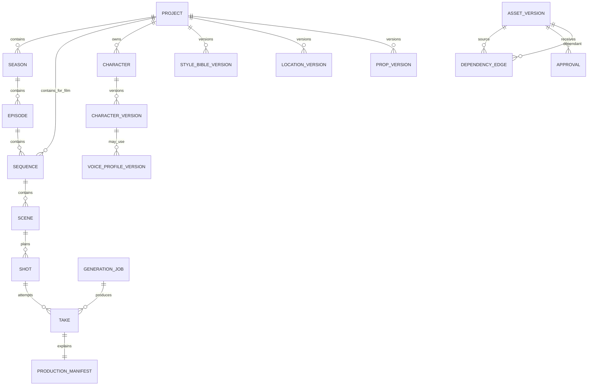

# Domain model and file layout

## 1. Design rules

- Internal identity uses immutable ULIDs; human-readable codes are scoped labels and may be changed safely.
- Every mutable creative object has immutable versions.
- Approval applies to a version, never to an unversioned name.
- Deleting from the UI means archive by default. Physical deletion is a separate, scoped maintenance action.
- Derived media records exact input-version dependencies and hashes.
- Remote file paths are never stored as the only location of an asset.
- Project JSON and manifests are portable; SQLite accelerates and coordinates them.

## 2. Aggregate hierarchy



## 3. Core records

### Project

| Field | Meaning |
| --- | --- |
| `id` | Immutable ULID |
| `code` | Human-readable short code |
| `type` | `series` or `film` |
| `title` | Display title |
| `status` | `development`, `production`, `paused`, `completed`, `archived` |
| `language` | Primary story/dialogue language |
| `deliveryProfileId` | Pinned resolution/frame-rate/audio/export profile |
| `budgetPolicyId` | Default estimates, hard caps, and worker limit |
| `createdAt`, `updatedAt` | Audit timestamps |

Series projects use seasons and episodes. Film projects can use a single implicit production plus sequences; both converge on scenes and shots.

### Creative definition records

The following use a stable identity record plus immutable versions:

- Character and character version.
- Voice profile and voice profile version.
- Style bible and style bible version.
- Location and location version.
- Prop and prop version.
- Wardrobe and wardrobe version.
- Script and script version.
- Storyboard and storyboard version.
- Delivery profile and workflow profile.

Each version contains:

```json
{
  "id": "01J...",
  "entityId": "01J...",
  "version": 3,
  "status": "draft",
  "basedOnVersionId": "01J...",
  "contentPath": "bibles/characters/CHAR-A/v003/character.json",
  "contentSha256": "...",
  "createdAt": "2026-08-21T10:00:00Z",
  "createdBy": "local-owner",
  "changeReason": "Approved winter wardrobe and clearer side profile"
}
```

Version status is `draft`, `in_review`, `approved`, `locked`, `superseded`, or `archived`. Locking does not erase prior versions.

### Shot

| Field | Meaning |
| --- | --- |
| `id` | Immutable shot identity |
| `code` | Example `E003-SC012-SH004` |
| `sceneId` | Owning scene |
| `editorialOrder` | Stable planned order |
| `durationFrames` | Canonical duration in frames, not a floating-point guess |
| `productionMethod` | `hold`, `pan_zoom`, `parallax`, `loop`, `ltx_i2v`, `ltx_a2v`, `ltx_keyframe`, `ltx_retake`, `ltx_lipdub`, `external` |
| `storyIntent` | Narrative purpose and required action |
| `cameraIntent` | Framing and movement, engine-neutral |
| `dialogueLineIds` | Approved line versions used by the shot |
| `referenceBindings` | Pinned character identity + scoped presentation/style, location, prop, and wardrobe versions |
| `acceptanceNotes` | What must be true for approval |
| `state` | Planning/review/production state |

Durations use `frames` plus a delivery profile frame rate. Generated-model durations are derived and reconciled explicitly.

### Take

A take is an immutable candidate output for a shot.

```json
{
  "id": "01J...",
  "shotId": "01J...",
  "takeNumber": 4,
  "sourceJobId": "01J...",
  "manifestId": "01J...",
  "mediaAssetVersionId": "01J...",
  "reviewState": "pending",
  "qualityFlags": [],
  "createdAt": "2026-08-21T10:00:00Z"
}
```

Review state is `pending`, `approved`, `rejected`, `needs_retake`, or `superseded`. A shot may have one active approved take per timeline version; earlier approvals remain in history.

### Voice profile version

Stores:

- Voice origin: `designed`, `built_in`, or `consented_reference`.
- Rights/consent record and permitted use.
- Qwen model/revision and conditioning type.
- Reference audio/transcript hashes or reusable prompt artifact.
- Language, accent, age range, timbre, pace, pitch, performance rules.
- Pronunciation dictionary version.
- Approved calibration lines and acceptance notes.

Celebrity/public-figure imitation is not a supported default. Reference voices need documented permission.

### Generation job

| Field | Meaning |
| --- | --- |
| `id` | Studio job ULID |
| `idempotencyKey` | Stable key for external retries |
| `projectId` | Isolation scope |
| `jobType` | Image, TTS, video, retake, lip-dub, upscale, assembly, QC |
| `engine` and `workflowVersion` | Exact implementation |
| `inputManifestPath` | Immutable request file |
| `estimate` | Expected GPU time/cost and confidence |
| `budgetReservation` | Maximum permitted spend |
| `state` | Durable state machine value |
| `workerLeaseId` | Assigned remote session, if any |
| `attempts` | Retry history and errors |
| `resultManifestPath` | Verified result |

### Creative writing job and external-skill receipt

A creative writing job proposes a new local version; it never edits a locked version or treats a provider conversation as canonical.

| Field | Meaning |
| --- | --- |
| `taskKind` | Story, character, world, outline, scene, dialogue rewrite, continuity, or storyboard planning |
| `sourceVersionIds` | Exact local facts/bibles/scripts selected as context |
| `providerProfile` | Provider, model, adapter/profile version, and request settings |
| `contextManifestPath` | User-previewed task-scoped context with hashes |
| `skillPlanPath` | Required, optional, excluded, permissions, and routing reasons |
| `skillReceiptIds` | Exact successful/failed skill execution records |
| `usageAndCost` | Input/output tokens and estimate/actual text API cost where available |
| `proposalPath` | Schema-validated draft proposal; not yet approved canonical content |

Each skill receipt pins skill ID/version/package hash, execution class, input hashes, sanitized calls, output hash, status, and timestamps. Historic receipts remain after a skill is disabled or removed.

### Character identity, presentation, and scoped style binding

Character identity facts (recognition anchors, stable biography, relationships, and proportions that must persist) are separate from presentation versions such as rendering style, age/story state, hair, wardrobe, and deliberate transformation. A `CharacterPresentationBinding` pins the identity version, presentation/style version, optional wardrobe/state versions, scope type/ID, start boundary, reason, and approval. More specific scopes override broader future defaults without modifying earlier bindings.

A new presentation version requires its own reference/consistency board and impact review. Voice and personality bindings do not change unless explicitly versioned in the same reviewed operation.

### Media asset and derivatives

A media asset version identifies one immutable, locally verified original by hash. Thumbnails, poster frames, waveforms, and review proxies are derivative records with source hash, recipe/version, format, dimensions/duration, and their own hashes. Derivatives are rebuildable caches and cannot replace the original or become an approved take silently.

### Production manifest

The manifest is the immutable receipt for a take or derived export. It contains the exact lineage listed in `ARCHITECTURE.md` and must be stored beside the output. A manifest schema change creates a new schema version; old manifests remain readable.

## 4. State machines

### Creative asset

```text
draft -> in_review -> approved -> locked
  |          |           |
  +-------> archived <----+

locked --new version--> draft (old version stays locked/superseded)
```

### Shot production

```text
planned
  -> blocked_missing_inputs
  -> ready_for_estimate
  -> awaiting_budget_approval
  -> queued
  -> generating
  -> syncing
  -> awaiting_review
  -> approved
  -> placed_in_timeline
  -> final_qc_passed
```

Any downstream state can become `stale` when an upstream dependency changes. `failed`, `cancelled`, and `needs_retake` retain history and a safe next action.

### Generation job

```text
created -> validated -> estimated -> authorized -> queued
       -> assigned -> running -> output_ready -> downloading
       -> verifying -> succeeded

terminal alternatives: rejected | cancelled | failed | expired
recovery states: retry_wait | reconciliation_required | download_pending
```

External calls are bracketed by durable intent and reconciliation records. A process crash can therefore decide whether to resume, inspect, or retry instead of guessing.

### Worker lease

```text
requested -> provisioning -> booting -> authenticating -> ready
ready <-> busy
ready/busy -> draining -> syncing -> terminating -> terminated

failure paths -> quarantine -> terminating -> terminated
```

`terminated` requires provider confirmation or an explicit unresolved incident state.

## 5. Dependency and stale propagation

Each edge is:

```json
{
  "sourceVersionId": "approved-character-v3",
  "dependantVersionId": "shot-plan-v8",
  "kind": "identity_reference",
  "required": true
}
```

Examples:

- Character v3 → storyboard frame v2 → LTX job → take v4 → timeline v6 → export v1.
- Script line v5 → TTS audio v3 → A2V take v2 → caption cue v4.
- Style bible v2 → environment board v3 and every shot that pins it.
- Character/script source versions + skill receipts → proposed creative draft → reviewed canonical version.
- Verified original media → local thumbnail/proxy → review session; derivative failure never makes the original stale.

When a new version is locked, the impact engine does not mark everything stale blindly. It compares edge kind and changed fields. A pronunciation-only voice change affects dialogue audio and downstream video/captions, but not silent establishing shots. Conservative fallback is to mark stale and ask for review.

## 6. Local workspace layout

```text
projects/
├── .studio/
│   └── catalog.sqlite            rebuildable local project library
└── <project-code>-<project-ulid>/
    ├── project.json
    ├── source/
    │   └── shuohao/<import-id>/       immutable imported JSON/reports
    ├── bibles/
    │   ├── style/
    │   ├── characters/<code>/v###/
    │   ├── voices/<code>/v###/
    │   ├── locations/<code>/v###/
    │   └── props/<code>/v###/
    ├── productions/
    │   ├── seasons/S##/episodes/E###/
    │   └── film/sequences/SQ###/
    ├── assets/
    │   ├── images/                    immutable originals + derived review media
    │   ├── audio/                     immutable originals + waveforms/proxies
    │   ├── video/                     immutable originals + poster frames/proxies
    │   └── documents/
    ├── provenance/
    │   ├── writing/                   provider-neutral request/result manifests
    │   └── skills/                    exact-version execution receipts
    ├── manifests/
    ├── jobs/
    ├── timelines/
    ├── exports/
    └── project.sqlite
```

Media filenames are friendly, but identity comes from manifest IDs and hashes. No code relies on user-visible names being unique.

Version 0.2.0 creates this directory skeleton, `project.json`, and `project.sqlite`. Creative entity/version records and media lineage remain planned; their folders are intentionally empty until those phases implement the corresponding contracts.

## 7. Multiple-series isolation

- Every query, path, cache key, job, worker upload, and cost entry requires `projectId`.
- The worker receives a session-scoped project token and a project-specific temporary root.
- Shared asset reuse is a copy operation that creates new project ownership plus lineage back to the source.
- Global model caches contain models/workflows only, never project bibles or voice references.
- Automated tests attempt path traversal, wrong-project IDs, cache collisions, and concurrent jobs across projects.

## 8. SQLite and file consistency

- File write: write temporary file, flush, compute hash, atomic rename, then commit index transaction.
- Database transaction records the expected file hash and manifest path.
- Startup reconciliation detects files without rows, rows without files, interrupted temp files, and incomplete jobs.
- Project export includes canonical files and manifests. The SQLite database may be included for speed but can be rebuilt.
- Backups capture a consistent database snapshot plus an immutable file inventory.

## 9. Schema evolution

Every schema has a positive integer version. Migration procedure:

1. Detect and explain required migration.
2. Create and verify backup.
3. Produce a migration preview and impact count.
4. Apply to a temporary copy.
5. Validate all contracts and hashes.
6. Atomically activate the migrated project.
7. Retain rollback metadata until a later verified backup.

No migration rewrites approved media or historical manifests merely to use a new default.
