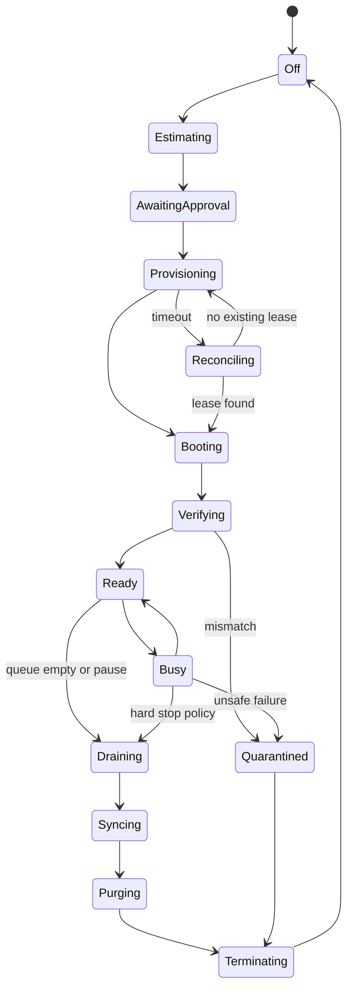

# Automatic cloud GPU operations

Current implementation note (0.10.1): official RunPod REST lifecycle, lease reconciliation, one-GPU job orchestration, cost/start approvals, authenticated gateway, loopback ComfyUI, preflight, watchdog, resumable transfers, purge/termination, candidate qualification, and atomic core-profile promotion are implemented. A controlled L40S Pod run created and updated one Pod, verified 11 model hashes and seven core workflow executions, and explicitly deleted the Pod. Production remains locked because creative/duration acceptance, durable model storage, and several recovery/shutdown/cost gates did not pass. See [live GPU qualification](LIVE_GPU_QUALIFICATION_2026-08-26.md) and [PRODUCTION_IMPLEMENTATION.md](PRODUCTION_IMPLEMENTATION.md).

## 1. User-facing promise

After one guided setup, the user does not install LTX, Qwen, Python, CUDA, ComfyUI, or model files for each session. Pressing **Start generation** creates a prepared worker; finishing or pressing **Stop GPU now** terminates it.

“Automatic” includes visible status, bounded spend, recoverable failure, and proof of termination. It does not mean hiding an unresolved cloud machine.

## 2. Version-1 provider shape

- Provider: RunPod through `GPUProvider`.
- Compute: temporary on-demand Pod created from a pinned template/worker image.
- Model cache: persistent network volume for production. The qualification used a non-persistent 350 GB Pod volume and therefore did not satisfy this requirement.
- Creative source and final results: authoritative local storage.
- Control: current RunPod REST API v2 from the local orchestrator.
- Execution: authenticated worker gateway; ComfyUI is internal.
- Shutdown: terminate the Pod after drain/sync; do not rely on a stopped Pod with attached network volume.

RunPod documents template-based Pod creation, REST start/stop/terminate operations, and network volumes that persist independently of compute. Current source links and prices are in `SOURCES.md`.

### Historical implementation boundary — version 0.3.0

Version 0.3.0 implemented only the first read-only account step and could not start a charge. Version 0.10.1 supersedes that boundary with the governed lifecycle described in this document and the controlled evidence linked above.

## 3. One-time setup wizard

### Account and credential

1. User creates/funds a RunPod account.
2. User creates a least-privilege API key where provider controls permit.
3. Desktop stores encrypted bytes through Electron asynchronous `safeStorage`; Windows protects the encryption key with DPAPI, and the bytes live outside all projects.
4. Desktop calls the API v2 read-only Pod/account check; a separate read-only catalogue call supplies current planning prices.
5. Key is never written to project files, `.env`, manifests, logs, screenshots, or support bundles.

Steps 1–5 are implemented, and the controlled qualification proved current create/update/delete permissions with one bounded Pod. Durable production storage, uncertain-response recovery, concurrency, idle/hard-deadline shutdown, and final invoice evidence remain locked.

### Storage

1. Select a supported region based on GPU availability, transfer access, and user location.
2. Create a network volume sized for pinned models, workflows, and cache.
3. Create worker-specific directories; never share a writable job directory between workers.
4. Upload/cache pinned models by checksum.
5. Verify model inventory and free-space reserve.

The pinned, policy-eligible core download set measures 151,109,498,566 bytes (140.73 GiB) from Hugging Face's revision metadata. Initial qualification planning therefore uses a 200GB `/workspace` volume, leaving working room for caches and receipts; the separately published worker image is not stored in that volume. The app shows the provider's current storage price before creation.

### Worker template

The versioned image contains:

- Supported Python/CUDA runtime.
- Worker gateway and watchdog.
- ComfyUI and pinned custom nodes.
- LTX/Qwen runtime dependencies.
- Core creative-QC helpers and the dependencies required by the qualified normal-generation workflows.
- FFmpeg/ffprobe and QC tools.
- Workflow pack and capability manifest.

Large model weights should normally live on the network volume so a worker image update does not duplicate them. The image is pinned by digest.

Qualification uses a RunPod secret named `huggingface_token`. The generated template passes only `{{ RUNPOD_SECRET_huggingface_token }}`, derives the accepted and required core model lists from policy, and enables Hugging Face network access only for the pinned bootstrap. Ordinary inference remains offline.

After publication and pull-by-digest verification, canonical signing uses the manual main-only `sign-worker-image.yml` workflow. The protected `worker-signing` job checks both the immutable manifest digest and local config/image digest, signs only `ghcr.io/sagesta/animated-series-worker`, and verifies the result against the exact GitHub workflow OIDC identity recorded in [SECURITY_AND_RECOVERY.md](SECURITY_AND_RECOVERY.md). Signing neither deploys the image nor unlocks RunPod; model, license, compatible-GPU, recovery, shutdown, quality, and readiness evidence remain separate gates.

The optional LTX trainer is not installed in the core image. D-054 also excludes the bundled-but-inert LatentSync candidate and its model downloads from first core promotion; a future lip-repair release requires its own accepted license decision and separately qualified profile evidence. Other advanced-profile dependencies require their own immutable image where needed, template, digest, capability report, evidence receipt, and rollback path. Selecting another registry does not remove this packaging requirement.

### Safety test

The setup finishes only after it proves:

- A compatible worker can be created.
- Gateway authentication and capability checks succeed.
- A tiny smoke job returns and verifies locally.
- Every core capability declares and passes its own smoke fixture before the core profile can promote. Advanced control/audio/adaptation candidates remain unavailable until their separate profile passes equivalent evidence; they do not block an otherwise complete core release.
- The remote watchdog has the correct hard deadline.
- Temporary project data can be purged.
- Provider termination returns a receipt and later reconciliation confirms no active worker.

The user sees actual test cost before approval.

## 4. Worker requirement and selection

A compiled batch declares:

```json
{
  "minVramGb": 32,
  "preferredVramGb": 48,
  "architectureAllowlist": ["benchmark-approved-class"],
  "workerImageDigest": "sha256:...",
  "modelCacheRegion": "...",
  "estimatedGpuSeconds": 5400,
  "hardDeadline": "...",
  "maxHourlyRate": 2.0
}
```

LTX-2.5's official open-source guidance currently lists 32GB+ VRAM and 100GB+ free storage, with larger 80GB data-center GPUs recommended for the full path. The studio uses only hardware actually benchmarked with its pinned workflow.

Selection order considers:

- Verified compatibility and VRAM.
- Current hourly price and user maximum.
- Location of the network volume.
- Availability and reliability history.
- Estimated cold start and data-transfer cost/time.

If no compatible offer exists within budget, the app stops and explains options. It never silently chooses an expensive GPU.

## 5. Automatic lifecycle



### Provisioning

- Persist create intent and idempotency key.
- Request one compatible Pod from the pinned template.
- If the request times out, search by tags/idempotency before retry.
- Record provider resource ID, quoted hourly rate, and provider start timestamp.

### Verification

- Authenticate gateway with a short-lived token.
- Compare worker image, GPU, disk, mount, model hashes, workflow hashes, schemas, and watchdog deadline.
- Compare the declared control roles, advanced LTX profiles, QC checkers, audio-effects/adaptation capabilities, and exact node/package hashes.
- Reject and terminate on any required mismatch.
- Perform no large upload before readiness passes.

### Execution

- Upload content-addressed inputs.
- Submit signed jobs and follow ordered events.
- Persist progress and provider cost snapshots.
- Continue within the authorized batch only.
- Reject unplanned jobs or jobs after budget/deadline expiry.
- Reject jobs that request runtime installation, arbitrary downloads, Git/package operations, unknown control roles, unapproved adaptations, or unvalidated cross-version model adapters.

### Drain and sync

- Stop accepting new jobs.
- Finish or safely cancel the current job according to user action and hard limits.
- Download results/manifests with resume where available.
- Verify local byte size, hash, media probe, and contract.
- Mark jobs succeeded only after local verification.

### Purge and terminate

- Send purge for the session's temporary project root.
- Retain only approved model/workflow caches.
- Call provider terminate.
- Reconcile until provider says terminated or raise an active-spend incident.
- Record termination receipt, final provider cost, and any discrepancy.

## 6. Independent shutdown guards

### Local guard

- Queue-empty idle timer, initially 10 minutes.
- User-configured maximum session time.
- Hard dollar budget based on current provider rate plus safety margin.
- `Pause after current job` and `Stop GPU now` controls.
- Startup reconciliation searches for studio-tagged active workers.

### Remote guard

At boot, the worker receives an immutable maximum lease deadline and session identity. The watchdog:

- Does not depend on the desktop connection.
- Refuses jobs whose deadline exceeds the lease.
- Begins drain before the hard deadline.
- Shuts down locally and/or calls a narrowly scoped termination path at deadline.
- Emits a signed final event where possible.

The provider hard limit remains authoritative even if both control channels fail; during implementation, choose provider mechanisms that support bounded execution or use an independent external monitor.

## 7. Budget enforcement

Before create:

- Estimate range and confidence.
- Current hourly offer.
- Storage cost reminder.
- Max workers.
- Session hard cap and time cap.

During execution:

- Reserve estimated cost per queued job.
- Stop assigning new work before the hard cap would be exceeded.
- Allow a small explicit shutdown/sync reserve.
- Warn at configurable thresholds.
- Do not extend a deadline silently because a generation is almost finished.

## 8. Multiple GPUs

- Version 1 supports 1–3 independent worker leases.
- Every worker runs the identical required image/model/workflow versions.
- Scheduler partitions independent shots and uses worker-specific upload/output paths.
- A shot attempt runs on one worker; multi-GPU distributed inference is a separate benchmarked capability and not assumed.
- Adding GPUs reduces wall-clock queue time. Three GPUs for one hour are roughly three GPU-hours, so the cost remains similar or may rise slightly from extra startup/idle overhead.
- The user sees both `estimated finish time` and `estimated total GPU-hours`.

Start with one GPU during pilot. Enable two or three only after job recovery, cost tracking, and cross-worker consistency pass.

## 9. Failure runbook

| Symptom | Automatic response | User message/action |
| --- | --- | --- |
| No GPU in chosen region | Try approved offers within limits, then stop | “No compatible GPU is currently available; no compute was started.” |
| Create request timeout | Reconcile by tags/idempotency | “Checking whether a machine was already created before retrying.” |
| Worker capability mismatch | Quarantine and terminate | “Prepared studio did not match the tested version; no generation began.” |
| Model cache missing/corrupt | Refuse batch; optionally repair within approved setup action | Explain expected time/cost before cache repair |
| Workflow requests missing/unpinned node | Quarantine and terminate; do not install it during production | “This prepared studio is incomplete. No workflow update will be installed while billing is active.” |
| Advanced control/profile unsupported | Refuse the affected job before generation | Offer a tested simpler method or a separately approved worker release |
| Job out of memory | Stop retry loop; record hardware/workflow failure | Offer compatible larger GPU or draft workflow |
| Desktop disconnect | Worker lease/watchdog continues within bound | Reconnect and reconcile; do not create replacement blindly |
| Download interrupted | Resume within sync grace | Keep user informed of active billing and stop deadline |
| Local disk full | Stop new jobs and preserve bounded remote grace | Ask user to free space or choose safe download location |
| Termination uncertain | Repeated provider reconciliation and high-priority alert | Show provider resource link/ID and `Retry termination` |

## 10. Serverless future path

RunPod supports scale-to-zero configurations, but large LTX model cold starts, cache locality, workflow debugging, and cost behavior must be measured. Serverless adoption requires an accepted decision and must preserve:

- Zero-worker idle compute.
- Exact model/workflow pinning.
- Budget enforcement.
- Durable jobs and output verification.
- Remote hard limits.
- Comparable or better cost and latency for real production batches.

It is an optimization, not a prerequisite for automatic operation.

## 11. Operator evidence

Every cloud session retains locally:

- Estimate and user authorization.
- Provider offer/rate and lease ID.
- Worker capability document.
- Job/event summaries and sanitized logs.
- Output manifests and hashes.
- Cost snapshots and final charge.
- Purge response and termination receipt.
- Any reconciliation or incident notes.
