# Full implementation plan

## 1. Delivery strategy

Build vertical, testable slices. The first meaningful output is a representative 60–90 second pilot, not a partially implemented 30-minute workflow. Every phase has an exit gate; work may prototype ahead, but the product cannot claim the later capability until the earlier evidence passes.

## 2. Phase map

```mermaid
flowchart LR
    P0[0 Baseline and benchmarks] --> P1[1 Local foundation]
    P1 --> P2[2 Writing, skills, normalization]
    P2 --> P3[3 Bibles and images]
    P3 --> P4[4 Voices and lines]
    P4 --> P5[5 Cloud worker automation]
    P5 --> P6[6 LTX video and review]
    P6 --> P7[7 Timeline, sound, captions, YouTube package]
    P7 --> P8[8 Multiple series, concurrency, recovery, learning]
    P8 --> P9[9 Installer and production release]
```



## 3. Phase 0 — lock the evidence baseline

### Deliverables

- Confirm current documents with the product owner.
- Inventory local Windows hardware, free disk, backup location, internet constraints, and target language/style.
- Lock the initial compatibility candidates: Node/Electron, Python/CUDA, ComfyUI, Qwen image, Qwen3-TTS, LTX, FFmpeg, RunPod region/GPU classes.
- Build a representative test pack with characters, locations, dialogue, movement, hands/props, two-person shots, retake, and lip repair.
- Record source/license snapshots and exact revisions.
- Estimate model cache and local project storage.
- Decide the exact 60–90 second end-to-end pilot scene.

### Spikes

1. Qwen character/reference consistency.
2. Qwen3-TTS designed/reusable voice consistency and local-vs-remote feasibility.
3. LTX draft/final, I2V, A2V, keyframe, retake, and lip-dub on candidate GPUs.
4. RunPod template/network-volume startup and termination.
5. FFmpeg delivery profile and media probes.
6. OpenAI/Anthropic story, character, long-form script, structured-output, context, and cost benchmark.
7. Declarative external-skill routing/required-receipt spike plus higher-risk MCP/tool/custom-node threat review.
8. Headless ComfyUI progress/output integration and local image/audio/video/proxy playback spike.
9. Timed animatic rebuild/timing-impact spike plus layered Qwen-image separation/parallax evaluation.
10. LTX-2.5 pose/depth/edge/mask, motion-track, reference-video, DFR, temporal-upsample, in/outpaint/relight, and multishot compatibility/cost spike.
11. Creative-assist identity/flicker/motion/lip/script-audio checker spike with human-reviewed positive/negative fixtures.
12. Rights-safe audio-effects/Foley spike and an optional project-adaptation spike only if reference-only consistency fails.
13. Public-thumbnail rules, timeline-derived chapter validation, release-package portability, YouTube policy-attestation wording, and read-only analytics/OAuth threat spike.

### Exit gate

- Selected model/workflow/GPU combinations have exact pins and measured results.
- Commercial-use/license review is recorded for intended use.
- Pilot quality is plausible and cost assumptions are replaced with measurement ranges.
- No unresolved blocker makes the architecture knowingly infeasible.

## 4. Phase 1 — local application foundation

### Current checkpoint — version 0.4.0

- `FOUND-001` is implemented as a development foundation: pinned pnpm/Electron/React/TypeScript workspace, secure desktop boundary, accessible navigation/wizard baseline, quality commands, production build, unpacked Windows smoke, and unsigned NSIS test installer.
- `DATA-001` is in progress: series/film create, list, open, current schema-2/backward-compatible schema-1 manifests, a guided v1→v2 preview with automatic verified backup and rollback at four injected failure points, identity-scoped folders, atomic manifest write/hash, per-project SQLite, rebuildable catalog, startup reconciliation, verified full backup/restore, tamper refusal, and live/stale single-writer handling are implemented and tested.
- `SEC-001` is in progress: the RunPod key is validated before save, encrypted through Electron asynchronous `safeStorage`/Windows DPAPI outside projects, never returned after submission, removable explicitly, and covered by plaintext non-leakage tests. Structured flushed diagnostics, protected-field/known-provider-secret/private-path redaction, renderer-boundary capture, and a local-only support JSON with a plain-language Settings flow are implemented and tested; broader worker/skill patterns, retention, and packaged scans remain.
- `CLOUD-001` has an intentionally early read-only foundation: API v2 account validation, aggregate existing-Pod/rate warning, GPU catalogue pricing, local guardrail defaults, and setup progress are implemented. No provider mutation or paid operation exists.
- `WRITE-001` is in progress: separate protected OpenAI/Anthropic setup, provider model-list validation, Responses/Messages structured adapters, exact context preview, explicit per-call approval, immutable project proposal records, usage/source lineage, and safe mocked tests are implemented. Live account switching, actual cost profiles, benchmark defaults, canon promotion/version comparison, and full AT-036/AT-039 evidence remain.
- Phase 1 is **not complete**. Archive UI, future-migration registry/upgrade breadth, broader non-migration interruption tests, broader diagnostic coverage/retention and packaged secret scans, incremental/release archives, clean-machine restore/usability evidence, and a signed installer remain.

### Build

- Set up pnpm workspace, TypeScript configuration, formatting/linting, unit tests, and release versioning.
- Create Electron main, secure preload, React renderer, routing, UI kit, accessibility baseline, and error boundary.
- Implement project creation/open/close and project types.
- Implement project files, SQLite index, atomic writes, file hashes, schema versions, migrations, and startup reconciliation.
- Implement the accepted Electron `safeStorage`/Windows DPAPI credential adapter outside project roots.
- Implement structured redacted logging and local support bundle foundation.
- Implement documentation/link/traceability checks in standard quality command.

### Exit gate

- Packaged development build creates and reopens series and film projects.
- Project isolation, atomic-write interruption, SQLite integrity, credential non-leakage, and migration rollback tests pass.
- A clean machine/user profile can launch the packaged shell without a developer environment.

## 5. Phase 2 — writing providers, external skills, upstream adapter, and long-form normalization

### Build

- Extend the protected credential vault and guided Settings UI for separate OpenAI and Anthropic accounts.
- Implement a provider-neutral writing contract plus first OpenAI Responses and Anthropic Messages adapters.
- Implement task-scoped context selection, structured draft validation, token/cost records, provider switching, and immutable creative lineage.
- Implement the external-skill manifest, quarantine/inspection, project-scoped enablement, compatibility and permission grants.
- Implement task-to-skill routing, visible plan, provider tool/instruction compilation, required-skill enforcement, output validation, timeouts, and exact-version execution receipts.
- Start with declarative skills; keep executable/MCP/remote-tool/Comfy-node classes locked until their stronger security gates pass.
- Implement read-only submodule version inspector and adapter process runner.
- Add contract fixtures for all six skills plus combined report.
- Import original JSON/reports into immutable project source folders.
- Parse/normalize outline, characters, art, script, storyboard, and shot recipe data.
- Add project-scoped ID mapping and source-alias registry.
- Add long-form episode acts/sequences and engine-neutral shot-plan conversion.
- Add versioned channel release profiles, explicit project/profile bindings, project-local film briefs, and a source-labelled Idea Library whose suggestions cannot start production.
- Preserve H3 prompts as source provenance, not executable LTX data.
- Implement plain-language validation and import preview/apply.
- Add upstream compatibility suite and update/rollback report.

### Exit gate

- OpenAI and Anthropic fixture accounts can be connected independently without secret leakage, and equivalent creative tasks produce provider-neutral validated drafts with recorded usage/cost.
- Required/optional/mismatched skill fixtures route correctly; a skipped required skill fails, and every claimed use has an exact-version receipt visible to the creator.
- Pinned upstream fixtures validate and normalize deterministically.
- Long-form conversion supports a 20–35 minute episode structure without editing upstream files or weakening its own validations.
- Upstream update candidate can fail compatibility and roll back cleanly.
- English UI can display normalized facts while preserving upstream source language/evidence.

## 6. Phase 3 — bibles, continuity, and image production

### Build

- Implement versioned characters, styles, locations, props, wardrobe, approvals, locks, dependency edges, and impact preview.
- Separate character identity from presentation/style/wardrobe/story-state versions and implement scoped shot/scene/episode/season/future bindings plus redesign impact/cost preview.
- Implement Qwen image adapter and worker workflows selected in Phase 0.
- Implement locally authorized media routes, immutable originals, rebuildable thumbnails/proxies, and in-app image comparison.
- Add candidate comparison, targeted edit, image metadata, hashes, and manifests.
- Implement required identity-pack checklist and consistency test pack.
- Add visual board, continuity table, and source/reference binding.
- Implement versioned control assets and layered foreground/subject/background composites with deterministic parallax preview.
- Add stale propagation from bible changes.

### Exit gate

- Lead identity pack is approved across required views, two environments, expressions, and multi-character test.
- A locked style/character/location change marks exactly the expected downstream fixtures stale.
- Scoped style-change fixtures preserve prior episodes and rebind only the approved boundary after the new consistency board passes.
- Image jobs are reproducible at the manifest level and do not cross projects.
- Approved images remain viewable and comparable after the worker/ComfyUI session is terminated.
- No bulk-video-ready shot can reference an unlocked lead identity.

## 7. Phase 4 — voice, line book, and captions source

### Build

- Implement voice origin/rights records, versioned voice profiles, calibration lines, and locks.
- Implement Qwen3-TTS adapter, reusable conditioning, line-level batches, delivery controls, and pronunciation dictionary.
- Store original WAV and derived normalized audio separately.
- Implement line review/retake, timing, waveform preview, and caption cue source.
- Add voice/line dependency and stale propagation.
- Implement timed animatic assembly/review/versioning from storyboard frames, approved/temporary audio, captions, and shot durations.

### Exit gate

- Two recurring voices pass identity, language, delivery, and pronunciation test pack.
- Regenerating unrelated lines does not alter approved lines.
- A pronunciation change makes only affected audio/video/caption dependencies stale.
- Consent-required reference voice cannot reach release readiness without evidence.

## 8. Phase 5 — automatic RunPod worker

### Build

- Build and sign versioned worker Docker image and capability manifest.
- Implement gateway routes, short-lived tokens, input hashing, job queue, artifact service, purge, and watchdog.
- Bind ComfyUI/model services to loopback.
- Implement RunPod account check, offer selection, template/volume setup, lease create/reconcile/cost/terminate.
- Implement desktop setup wizard and cloud session screen.
- Implement durable worker leases, independent local/remote limits, sync and termination receipts.
- Add one-GPU smoke jobs for image, TTS, and media QC.

### Exit gate

- One click provisions a tested worker, executes a job, verifies output locally, purges temporary project data, and terminates compute.
- Forced desktop crash and network interruption still respect the hard deadline.
- Create timeout reconciliation proves no duplicate Pod.
- External scan shows no public ComfyUI.
- Actual provider cost is captured and reconciled.

## 9. Phase 6 — LTX video, scheduler, and take review

### Build

- Implement neutral video jobs and LTX compilation for draft/final I2V, A2V, keyframe, retake, lip-dub, upscale, benchmark-approved structural/motion/reference control, DFR, temporal-upsample, in/outpaint/relight, and multishot profiles selected in Phase 0.
- Implement audio-preservation and A/V timing checks.
- Implement creative-assist identity/continuity/flicker/motion/face/hand/text/lip/script-audio evidence without approval authority.
- Implement dependency-aware queue, estimates, budget reservations, retry classes, and changed-hypothesis retake notes.
- Implement shot/take states, A/B review, quality tags, approvals, rejection, targeted repair, and manifest inspector.
- Implement production-method fallbacks and retry stop rules.

### Exit gate

- Representative 60–90 second pilot is produced end to end without terminal/cloud console use.
- Character and voice remain acceptably consistent by human review.
- Failed/retake paths preserve earlier takes and costs.
- Every approved take has complete lineage and actual cost.
- Queue recovers from forced desktop and worker interruption.

## 10. Phase 7 — timeline, sound, captions, QC, and YouTube packaging

### Build

- Implement deterministic rough-cut timeline from approved shot order/duration.
- Add holds, pan/zoom, simple parallax, loops, safe trim/replace, transitions, and title cards.
- Add dialogue, ambience, effects, music layers and derived mix.
- Implement the rights-aware audio-effects adapter and separate synchronized foley/ambience cue review; keep incompatible LTX adapters disabled.
- Generate/adjust SRT/VTT from approved line timings.
- Implement FFmpeg render profiles and automated technical QC.
- Implement final human checklist, rights readiness, master delivery lock, export package, and optional editor handoff selected in Phase 0/O-005.
- Implement Thumbnail Room with approved-source selection, authorized image generation/editing, deterministic typography/layout, responsive previews, candidate lineage, technical checks, and human selection.
- Implement Release Details with factual title/description variants, timeline-derived chapter validation, captions/languages, category/playlist/tags/hashtags/credits/links/end-screen notes, and no universal SEO score.
- Implement human audience, altered/synthetic-media, truthful-packaging, originality, rights/credits, and full-watch attestations without automatic defaults.
- Implement unified Release Readiness and an immutable hash-inventoried manual-upload package with a plain-language YouTube Studio checklist. Automatic publishing remains outside version 1.

### Exit gate

- Pilot export matches delivery profile and passes media/caption/manifests QC.
- Timeline rebuild from manifests is deterministic.
- Replacing an approved take invalidates/rebuilds only affected timeline/export versions.
- A full human watch signs release readiness.
- Thumbnail/details/policy changes create a new package version; a clean-machine verification proves the selected master, thumbnail, captions, details, attestations, QC, and manifests are complete and unchanged.

## 11. Phase 8 — scale, multiple series, concurrency, and disaster recovery

### Build

- Harden many-episode asset/dependency queries and archive views.
- Enable two then three independent workers with budget and compatibility limits.
- Add worker-specific cache paths and result-order independence.
- Add cross-project attack/isolation tests and explicit asset-copy workflow.
- Add incremental backups, release archives, verified restore UI, and clean-machine restore drill.
- Add benchmark dashboard and cost-per-approved-second reporting.
- Add manual video-ID/URL registration, schema-validated official report import, and immutable performance snapshots.
- After O-009 and OAuth/security approval, add an optional least-privilege read-only YouTube Analytics adapter that has no upload/update/delete capability.
- Add evidence-backed, confidence-labelled learning recommendations that require human approval, remain scope-limited, and affect only future work.
- Produce a representative multi-scene pilot and then a full 20–35 minute validation episode.

### Exit gate

- Multiple series and a one-off film coexist without leakage.
- One-, two-, and three-worker runs produce compatible outputs and accurate total GPU-hour accounting.
- Clean-machine restore passes without network volume.
- Full-length episode meets creative, continuity, technical, recovery, and budget gates.
- Imported/collected performance evidence cannot cross profiles/projects, overwrite a snapshot, fabricate an experiment winner, mutate locked history, or start paid work.

## 12. Phase 9 — installer and production release

### Build

- Signed Windows installer, upgrade/rollback, prerequisites, and disk checks.
- Guided first-run setup and diagnostics.
- Compatibility-matrix update mechanism with signature verification.
- Release notes, in-app help, recovery guide, and support bundle.
- Threat review, dependency/SBOM scan, license/NOTICE package, and privacy review.
- Release rehearsal from clean computer and clean provider account.

### Exit gate

- Non-technical usability acceptance passes with no terminal assistance.
- Upgrade and rollback preserve active projects.
- Documentation, traceability, security, backup/restore, cost, and release tests pass.
- `STATUS.md` accurately lists production capability and known limitations.

## 13. Critical path and non-negotiable gates

Critical path:

```text
model/provider benchmark
  -> local durable project model
  -> upstream normalization
  -> locked image/voice references
  -> safe automatic worker
  -> LTX pilot
  -> deterministic edit/export
  -> verified YouTube release package
  -> recovery/concurrency
  -> full episode
  -> optional evidence-backed learning
```

Do not:

- Build the whole editor before proving a generated pilot.
- Generate a season before locking a representative bible and voice.
- Enable multiple GPUs before one-worker recovery/cost accuracy passes.
- adopt a model/update from a moving branch.
- claim “automatic shutdown” without a remote independent test.
- treat a successful render as a successful production workflow without local verification and review.
- treat thumbnail candidates as a real audience experiment without accepted platform evidence.
- auto-publish, infer a made-for-kids/disclosure answer, or let an SEO/analytics score bypass human release authority.

## 14. Definition of done for every work item

- Requirement and acceptance behavior identified.
- Code/config/workflow implemented behind the correct boundary.
- Unit/contract/integration tests added.
- Failure and rollback behavior tested.
- Secrets and project isolation reviewed.
- Metrics/logging/cost behavior included where relevant.
- Affected user, architecture, contract, operations, sources, status, traceability, and changelog documents updated.
- `node scripts/check-docs.mjs` and the applicable quality suite pass.
- No planned capability is described as complete before evidence exists.

## 15. First implementation backlog

This is the delivery-order summary. The granular, append-only work ledger is [BUILD_BACKLOG.md](BUILD_BACKLOG.md); new accepted features, risks, and fixes are added there without removing unfinished earlier work.

| Order | Work package | Current state | Output |
| --- | --- | --- | --- |
| 1 | `FOUND-001` workspace/toolchain | Foundation implemented; signed/clean-machine release pending | Buildable TypeScript/Electron shell |
| 2 | `DATA-001` project store | In progress — verified full backup/restore, writer lock, and guided v1→v2 migration rollback matrix pass; archive/future migration/recovery breadth remain | Series/film create/open, files, SQLite, migrations, recovery |
| 3 | `SEC-001` credential/logging | In progress — separate protected RunPod/OpenAI/Anthropic vaults plus local redacted diagnostics/support file pass; broader provider/worker/skill and packaged scans remain | Vault adapter and redacted diagnostics |
| 4 | `WRITE-001` provider-neutral creative writing | In progress — setup, structured adapters, context preview, explicit approval, local proposal lineage, and mocked tests pass | Live provider switching/benchmark/cost evidence plus canon promotion and full AT-036/AT-039 |
| 5 | `SKILL-001` external-skill runtime | Not started | Safe install, routing, required execution, validation, and receipts |
| 6 | `UP-001` adapter process runner | Not started | Pinned version and validation contract |
| 7 | `UP-002` normalized domain import | Not started | Long-form project facts and source provenance |
| 8 | `CONT-001` versions/dependencies | Not started | Locks, impact, stale propagation |
| 9 | `BENCH-001` writing/image/voice/video test harness | Not started | Repeatable quality/runtime/token/GPU cost pack |
| 10 | `VIEW-001` local media review | Not started | Secure gallery, audio/video player, comparisons, proxies |
| 11 | `WORKER-001` gateway/watchdog | Not started | Secure local GPU smoke worker |
| 12 | `CLOUD-001` RunPod lifecycle | In progress — API v2 account/price reads and local limits pass mocked tests; every mutating lifecycle method remains locked | One-click create/reconcile/terminate |
| 13 | `COMFY-001` workflow registry/compiler | Not started | Only approved, versioned, hash-locked workflows can run |
| 14 | `COMFY-002` compatibility/preflight | Not started | Exact runtime/model/node inventory and cheap smoke pass |
| 15 | `COMFY-003` headless execution bridge | Not started | Plain-language queue/progress/preview/error states |
| 16 | `COMFY-004` output verification/retry/QC | Not started | Corrupt or unsafe output and wasteful retry paths fail safely |
| 17 | `COMFY-005` update qualification/rollback | Not started | Failed candidate cannot replace the last working production pin |
| 18 | `ANIMATIC-001` timed pacing preview | Not started | Versioned storyboard/dialogue animatic and timing-impact gate |
| 19 | `CONTROL-001` engine-neutral shot controls | Not started | Pose/depth/edge/mask/motion/reference controls validated before spend |
| 20 | `LAYER-001` layered parallax assets | Not started | Immutable-source foreground/subject/background composites |
| 21 | `LTXADV-001` advanced LTX profiles | Not started | Compatible control, DFR, temporal, repair, and multishot benchmark |
| 22 | `CREATIVE-QC-001` assistive review evidence | Not started | Identity/flicker/motion/lip/script-audio warnings without auto-approval |
| 23 | `FOLEY-001` rights-aware sound effects | Not started | Separate synchronized ambience/effects/foley assets |
| 24 | `ADAPT-001` optional project adaptation | Not started | Benchmark-gated character/style LoRA with dataset rights and rollback |
| 25 | `MEDIA-001` image + voice vertical slice | Not started | Locked character and voice assets |
| 26 | `VIDEO-001` LTX vertical slice | Not started | One reviewed dialogue/motion shot |
| 27 | `PILOT-001` 60–90 second production | Not started | Full end-to-end proof |
| 28 | `YT-PROFILE-001` release profiles and ideas | Not started | Versioned multi-series packaging guidance and source-labelled idea backlog |
| 29 | `THUMB-001` public Thumbnail Room | Not started | Truthful, responsive, versioned candidates linked to approved media |
| 30 | `YT-META-001` Release Details | Not started | Human-selected metadata, timeline-derived chapters, and deterministic validation |
| 31 | `YT-POLICY-001` human release attestations | Not started | Explicit audience/disclosure/truth/originality/rights/full-watch decisions |
| 32 | `YT-PACKAGE-001` manual-upload package | Not started | Immutable verified master, thumbnail, details, captions, checks, and manifests |
| 33 | `YT-ANALYTICS-001` and `YT-LEARN-001` | Not started | Optional real performance evidence and human-approved prospective lessons |
